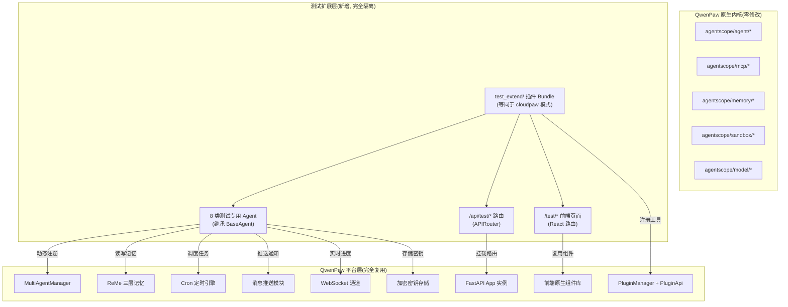
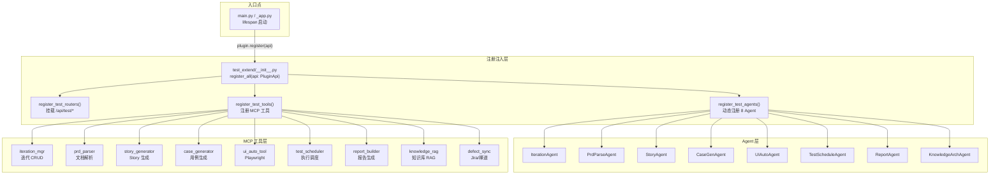
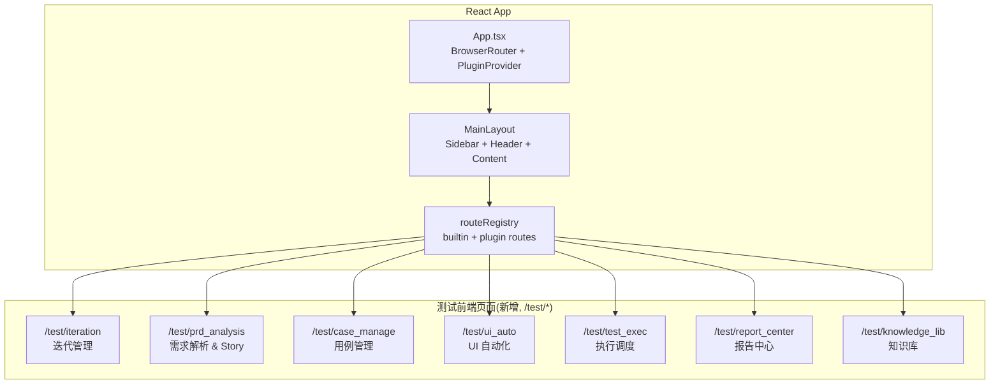
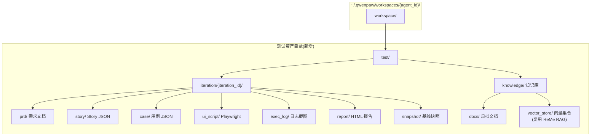

# AI 端到端测试平台技术设计

Feature Name: ai-test-platform
Updated: 2026-07-07

---

## Description

基于 QwenPaw 开源底座，通过「Bundle 插件 + 测试专用 Agent + 独立前端路由」模式扩展一套完整的 AI 端到端测试工作台。所有新增代码隔离于 `src/qwenpaw/test_extend/` 和 `console/src/pages/test/` 目录，零侵入内核。

---

## Architecture

### 整体架构



### 后端分层架构



### 前端架构



### 数据存储架构



---

## Components and Interfaces

### 1. 插件注册入口: `test_extend/plugin.py`

作为 Bundle 插件注册至 QwenPaw 插件市场，pluign.json 声明如下：

```json
{
  "id": "test-platform",
  "version": "0.1.0",
  "type": "general",
  "entry": {
    "frontend": "ui/dist/test-platform.js",
    "backend": "plugin.py"
  },
  "qwenpaw_version": { "min": "2.0.0" }
}
```

#### 接口: `TestPlatformPlugin.register(api: PluginApi)`

```python
class TestPlatformPlugin:
    def register(self, api: PluginApi):
        # 1. 注册 HTTP 路由 (优先级最高，确保路由先挂载)
        api.register_http_router(test_router, prefix="/test", tags=["Test Platform"])

        # 2. 注册测试专用 MCP 工具
        register_test_mcp_tools(api)

        # 3. 注册启动钩子，初始化 Agent 和目录结构
        api.register_startup_hook(
            hook_name="test_platform_init",
            callback=self._on_startup,
            priority=50  # 在 cloudpaw(50) 之后执行
        )

        # 4. 注册关闭钩子，清理临时资源
        api.register_shutdown_hook(
            hook_name="test_platform_shutdown",
            callback=self._on_shutdown
        )

    async def _on_startup(self):
        await register_test_agents()
        await ensure_test_storage_structure()

    async def _on_shutdown(self):
        await cleanup_test_runtimes()
```

### 2. 目录结构

```
src/qwenpaw/test_extend/
├── __init__.py                    # 空, 标记为包
├── plugin.py                      # 插件注册入口 (TestPlatformPlugin)
├── plugin.json                    # 插件元数据声明
├── agents/                        # 8 类测试专用 Agent
│   ├── __init__.py
│   ├── base.py                    # TestBaseAgent (继承 QwenPawAgent)
│   ├── iteration_agent.py         # IterationAgent: 迭代 CRUD
│   ├── prd_parse_agent.py         # PrdParseAgent: 需求解析
│   ├── story_agent.py             # StoryAgent: Story 拆解
│   ├── case_gen_agent.py          # CaseGenAgent: 用例生成
│   ├── ui_auto_agent.py           # UIAutoAgent: UI 自动化
│   ├── test_schedule_agent.py     # TestScheduleAgent: 执行调度
│   ├── report_agent.py            # ReportAgent: 报告生成
│   └── knowledge_arch_agent.py    # KnowledgeArchAgent: 知识归档
├── mcp_tools/                     # 9 个 MCP 工具实现
│   ├── __init__.py
│   ├── iteration_mgr.py           # 迭代管理工具
│   ├── prd_parser.py              # 需求文档解析工具
│   ├── story_generator.py         # Story 生成工具
│   ├── case_generator.py          # 用例生成工具
│   ├── ui_auto_tool.py            # Playwright UI 自动化工具
│   ├── test_scheduler.py          # 测试执行调度工具
│   ├── report_builder.py          # 报告生成工具
│   ├── defect_sync.py             # 缺陷同步工具 (Jira/禅道)
│   └── knowledge_rag.py           # 知识库 RAG 工具
├── routers/                       # FastAPI 路由
│   ├── __init__.py
│   ├── iteration.py               # /api/test/iteration/*
│   ├── prd_analysis.py            # /api/test/prd/*
│   ├── case_manage.py             # /api/test/case/*
│   ├── ui_auto.py                 # /api/test/ui-auto/*
│   ├── test_exec.py               # /api/test/exec/*
│   ├── report_center.py           # /api/test/report/*
│   └── knowledge_lib.py           # /api/test/knowledge/*
├── storage/                       # 存储管理
│   ├── __init__.py
│   ├── paths.py                   # 测试目录路径管理
│   ├── iteration_store.py         # 迭代数据 CRUD (JSON 文件)
│   ├── snapshot.py                # 迭代快照打包/还原
│   └── asset_archiver.py          # 资产归档至知识库
├── models/                        # Pydantic 数据模型
│   ├── __init__.py
│   ├── iteration.py               # Iteration, IterationStatus
│   ├── story.py                   # Story, AcceptanceCriteria
│   ├── test_case.py               # TestCase, CaseType, CasePriority
│   ├── execution.py               # ExecutionResult, TestRun
│   ├── report.py                  # TestReport, DefectSummary
│   └── traceability.py            # TraceRecord (追溯 ID)
└── common/                        # 公共工具
    ├── __init__.py
    ├── trace_id.py                # 追溯 ID 生成器
    ├── config.py                  # 测试平台配置常量
    └── utils.py                   # 通用工具函数
```

### 3. TestBaseAgent 设计

所有测试 Agent 的基类，继承 QwenPawAgent：

```python
# src/qwenpaw/test_extend/agents/base.py
from qwenpaw.agents.react_agent import QwenPawAgent

class TestBaseAgent(QwenPawAgent):
    """测试专用 Agent 基类，统一注入测试工具集和存储路径"""

    test_storage_root: Path  # workspace/test/
    iteration_id: str | None # 当前操作的迭代 ID

    @classmethod
    async def create_for_iteration(
        cls,
        agent_name: str,
        iteration_id: str,
        manager: MultiAgentManager,
        **kwargs
    ) -> "TestBaseAgent":
        pass
```

### 3.1 IterationAgent (迭代管理)

```
Agent 名称: iteration-agent
所属 MCP 工具: iteration_mgr
复用能力: Cron, ReMe 长期记忆, 文件读写
```

**接口**:
- `create_iteration(name, version, dates, module, git_branch, env) -> Iteration`
- `get_iteration(iteration_id) -> Iteration`
- `list_iterations(status_filter) -> list[Iteration]`
- `update_iteration_status(iteration_id, new_status) -> bool`
- `create_snapshot(iteration_id) -> Snapshot`
- `diff_iterations(iteration_id_a, iteration_id_b) -> DiffResult`
- `sync_from_jira(project_key) -> list[Story]`
- `schedule_regression(iteration_id, cron_expr) -> bool`

### 3.2 PrdParseAgent (需求解析)

```
Agent 名称: prd-parse-agent
所属 MCP 工具: prd_parser
复用能力: 多模态 VLM 文件解析, RAG 检索
```

**接口**:
- `parse_document(file_path) -> ParsedPrd`
- `parse_openapi(spec_url) -> ParsedApiSpec`
- `parse_figma(figma_url) -> ParsedDesign`
- `identify_ambiguities(parsed_prd) -> RiskChecklist`
- `store_parse_result(iteration_id, result) -> None  # 存入临时记忆`

### 3.3 StoryAgent (Story 拆解)

```
Agent 名称: story-agent
所属 MCP 工具: story_generator
复用能力: 结构化输出, 多轮对话记忆
```

**接口**:
- `generate_stories(parsed_prd, iteration_id) -> list[Story]`
- `refine_story(story_id, feedback) -> Story`
- `validate_story_completeness(story) -> ValidationResult`
- `generate_traceability(story_id) -> TraceTree`

### 3.4 CaseGenAgent (用例生成)

```
Agent 名称: case-gen-agent
所属 MCP 工具: case_generator
复用能力: 规则编排, RAG 向量知识库检索
```

**接口**:
- `generate_cases(story_id, dimensions) -> list[TestCase]`
- `enhance_with_knowledge_base(story_id) -> list[TestCase]`
- `calculate_coverage(iteration_id) -> CoverageReport`
- `export_cases(case_ids, format="excel") -> bytes`

### 3.5 UIAutoAgent (UI 自动化)

```
Agent 名称: ui-auto-agent
所属 MCP 工具: ui_auto_tool
复用能力: MCP 浏览器调用, 截图存储, 沙箱 FileGuard/ToolGuard
```

**接口**:
- `generate_script(test_case, page_object) -> str`
- `debug_script(script_content, test_case_id) -> DebugResult`
- `execute_script(script_content, env_config) -> ExecutionResult`
- `capture_screenshot(test_case_id, step) -> Path`

### 3.6 TestScheduleAgent (执行调度)

```
Agent 名称: test-schedule-agent
所属 MCP 工具: test_scheduler
复用能力: 多子任务并行, 沙箱进程调度, WebSocket 实时推送
```

**接口**:
- `run_batch(case_ids, concurrency, env) -> TestRun`
- `run_single(case_id, env) -> ExecutionResult`
- `retry_failed(test_run_id) -> TestRun`
- `get_execution_progress(test_run_id) -> ProgressInfo`

### 3.7 ReportAgent (报告生成)

```
Agent 名称: report-agent
所属 MCP 工具: report_builder
复用能力: 文件导出, 日志解析, 图表生成
```

**接口**:
- `generate_report(test_run_id) -> TestReport`
- `analyze_failures(test_run_id) -> FailureAnalysis`
- `push_notification(report_id, channels) -> bool`
- `export_report(report_id, format="html") -> bytes`

### 3.8 KnowledgeArchAgent (知识归档)

```
Agent 名称: knowledge-arch-agent
所属 MCP 工具: knowledge_rag
复用能力: ReMe 向量记忆, 批量文档入库, Embedding 调用
```

**接口**:
- `archive_iteration(iteration_id) -> ArchiveResult`
- `search_knowledge(query, filters) -> list[KnowledgeItem]`
- `upload_document(file_path, metadata) -> bool`
- `distill_knowledge(product_line) -> DistillResult`

### 4. MCP 工具接口注册

每个 MCP 工具通过 `PluginApi.register_tool()` 注册：

```python
# src/qwenpaw/test_extend/mcp_tools/__init__.py
from qwenpaw.plugins.api import PluginApi

def register_test_mcp_tools(api: PluginApi):
    """注册全部测试 MCP 工具至原生工具管道"""

    from .iteration_mgr import (
        create_iteration, get_iteration, list_iterations,
        update_iteration_status, create_snapshot, diff_iterations,
        sync_from_jira, schedule_regression,
    )
    from .prd_parser import parse_document, parse_openapi, parse_figma
    from .story_generator import generate_stories, validate_story
    from .case_generator import generate_cases, calculate_coverage, export_cases
    from .ui_auto_tool import generate_script, debug_script, execute_script
    from .test_scheduler import run_batch, run_single, retry_failed
    from .report_builder import generate_report, push_report
    from .defect_sync import submit_defect, sync_defect_status
    from .knowledge_rag import archive_iteration, search_knowledge, distill

    tools = [
        # iteration_mgr
        ("create_iteration", create_iteration, "Create a new test iteration"),
        ("get_iteration", get_iteration, "Get iteration details"),
        # ...
        # 注册所有工具
    ]
    for name, func, desc in tools:
        api.register_tool(tool_name=name, tool_func=func, description=desc, enabled=False)
```

### 5. 前端路由接口

```typescript
// console/src/pages/test/register.ts
// 通过 window.QwenPaw.route.add() 注册测试页面路由

import { routeRegistry } from "@/plugins/registry/store";

export function registerTestRoutes() {
  const testRoutes = [
    { id: "test.iteration",   path: "/test/iteration",     component: lazy(() => import("./iteration")) },
    { id: "test.prd_analysis", path: "/test/prd_analysis", component: lazy(() => import("./prd_analysis")) },
    { id: "test.case_manage",  path: "/test/case_manage",  component: lazy(() => import("./case_manage")) },
    { id: "test.ui_auto",      path: "/test/ui_auto",      component: lazy(() => import("./ui_auto")) },
    { id: "test.test_exec",    path: "/test/test_exec",    component: lazy(() => import("./test_exec")) },
    { id: "test.report_center", path: "/test/report_center", component: lazy(() => import("./report_center")) },
    { id: "test.knowledge_lib", path: "/test/knowledge_lib", component: lazy(() => import("./knowledge_lib")) },
  ];

  routeRegistry.add("test-platform", testRoutes);
}
```

### 6. 前端侧边栏菜单注册

```typescript
// console/src/pages/test/menu.ts
// 复用原生侧边栏组件，通过 pluginSystem 注入菜单

export const TEST_MENU_ITEMS = [
  {
    key: "test",
    label: "AI 测试工作台",
    icon: <BugOutlined />,
    children: [
      { key: "test.iteration",    label: "迭代管理",     icon: <RocketOutlined /> },
      { key: "test.prd_analysis", label: "需求解析",     icon: <FileTextOutlined /> },
      { key: "test.case_manage",  label: "用例管理",     icon: <CheckSquareOutlined /> },
      { key: "test.ui_auto",      label: "UI 自动化",    icon: <PlayCircleOutlined /> },
      { key: "test.test_exec",    label: "执行调度",     icon: <ThunderboltOutlined /> },
      { key: "test.report_center", label: "报告中心",     icon: <BarChartOutlined /> },
      { key: "test.knowledge_lib", label: "知识库",      icon: <BookOutlined /> },
    ],
  },
];
```

### 7. API 路由设计

所有测试 API 通过 FastAPI APIRouter 前缀 `/api/test` 挂载：

| 方法 | 路径 | 说明 |
|------|------|------|
| POST | `/api/test/iteration/` | 创建迭代 |
| GET | `/api/test/iteration/` | 获取迭代列表 |
| GET | `/api/test/iteration/{id}` | 获取迭代详情 |
| PUT | `/api/test/iteration/{id}` | 更新迭代 |
| POST | `/api/test/iteration/{id}/snapshot` | 创建快照 |
| GET | `/api/test/iteration/diff?a={id}&b={id}` | 迭代 Diff |
| POST | `/api/test/prd/parse` | 解析需求文档 |
| POST | `/api/test/story/generate` | 生成 Story |
| GET | `/api/test/story/{id}` | 获取 Story 详情 |
| PUT | `/api/test/story/{id}` | 更新 Story |
| POST | `/api/test/case/generate` | 批量生成用例 |
| GET | `/api/test/case/{id}` | 获取用例详情 |
| PUT | `/api/test/case/{id}` | 更新用例 |
| GET | `/api/test/case/export` | 导出用例 Excel |
| POST | `/api/test/ui-auto/generate` | 生成 Playwright 脚本 |
| POST | `/api/test/ui-auto/debug` | 调试单条脚本 |
| GET | `/api/test/ui-auto/script/{id}` | 获取脚本内容 |
| PUT | `/api/test/ui-auto/script/{id}` | 保存修改后的脚本 |
| POST | `/api/test/exec/run` | 启动批量执行 |
| POST | `/api/test/exec/run-single` | 单条执行 |
| GET | `/api/test/exec/progress/{run_id}` | 获取执行进度 |
| GET | `/api/test/exec/history?iteration={id}` | 历史执行记录 |
| POST | `/api/test/report/generate` | 生成报告 |
| GET | `/api/test/report/{id}` | 获取报告详情 |
| GET | `/api/test/report/export/{id}` | 下载报告 |
| POST | `/api/test/report/push/{id}` | 推送报告 |
| POST | `/api/test/defect/submit` | 提交缺陷 |
| POST | `/api/test/knowledge/search` | 搜索知识库 |
| POST | `/api/test/knowledge/archive` | 归档迭代 |
| POST | `/api/test/knowledge/distill` | 蒸馏知识库 |

### 8. 存储路径接口

```python
# src/qwenpaw/test_extend/storage/paths.py
from pathlib import Path

def get_test_root(workspace_dir: Path) -> Path:
    """返回测试资产根目录: {workspace}/test/"""
    return workspace_dir / "test"

def get_iteration_dir(workspace_dir: Path, iteration_id: str) -> Path:
    """返回迭代目录: {workspace}/test/iteration/{id}/"""
    return get_test_root(workspace_dir) / "iteration" / iteration_id

def get_prd_dir(workspace_dir: Path, iteration_id: str) -> Path:
    """返回需求文档目录"""
    return get_iteration_dir(workspace_dir, iteration_id) / "prd"

def get_story_dir(workspace_dir: Path, iteration_id: str) -> Path:
    """返回 Story 目录"""
    return get_iteration_dir(workspace_dir, iteration_id) / "story"

def get_case_dir(workspace_dir: Path, iteration_id: str) -> Path:
    """返回用例目录"""
    return get_iteration_dir(workspace_dir, iteration_id) / "case"

def get_script_dir(workspace_dir: Path, iteration_id: str) -> Path:
    """返回脚本目录"""
    return get_iteration_dir(workspace_dir, iteration_id) / "ui_script"

def get_exec_log_dir(workspace_dir: Path, iteration_id: str) -> Path:
    """返回执行日志目录"""
    return get_iteration_dir(workspace_dir, iteration_id) / "exec_log"

def get_report_dir(workspace_dir: Path, iteration_id: str) -> Path:
    """返回报告目录"""
    return get_iteration_dir(workspace_dir, iteration_id) / "report"

def get_snapshot_dir(workspace_dir: Path, iteration_id: str) -> Path:
    """返回快照目录"""
    return get_iteration_dir(workspace_dir, iteration_id) / "snapshot"

def get_knowledge_dir(workspace_dir: Path) -> Path:
    """返回知识库根目录"""
    return get_test_root(workspace_dir) / "knowledge"
```

### 9. 与外部系统集成 (Playwright / Jira 等)

```
┌──────────────────────┐
│  test_extend/mcp_tools │
│                      │
│  playwright_wrapper  │─── subprocess ───▶ Playwright (沙箱进程, 复用 FileGuard/ToolGuard)
│                      │
│  jira_adapter        │─── HTTP ──────────▶ Jira REST API (复用平台 http 请求 MCP + 密钥存储)
│                      │
│  zentao_adapter      │─── HTTP ──────────▶ ZenTao OpenAPI
│                      │
│  doc_parser          │─── 内联调用 ───────▶ 平台原生文件解析 + VLM
│                      │
│  vector_store        │─── API 调用 ──────▶ ReMe RAG 向量存储 (独立 test 集合)
└──────────────────────┘
```

---

## Data Models

### Iteration

```python
class IterationStatus(str, Enum):
    DRAFT = "draft"
    REVIEWING = "reviewing"
    TESTING = "testing"
    RELEASED = "released"
    ARCHIVED = "archived"

class Iteration(BaseModel):
    id: str                              # 唯一标识
    name: str
    version: str
    module: str
    description: str | None = None
    start_date: date
    end_date: date
    git_branch: str | None = None
    test_environment: str | None = None
    status: IterationStatus = IterationStatus.DRAFT
    created_at: datetime
    updated_at: datetime
```

### Story

```python
class AcceptanceCriteria(BaseModel):
    scenario: str                      # Given-When-Then 格式
    gherkin: str                       # 完整 Gherkin 描述

class Story(BaseModel):
    id: str
    iteration_id: str
    parent_story_id: str | None = None
    title: str
    as_a: str
    i_want: str
    so_that: str
    acceptance_criteria: list[AcceptanceCriteria]
    priority: str = "medium"
    traceability_id: str              # 全链路追溯 ID
    is_validated: bool = False
    validation_issues: list[str] = []
```

### TestCase

```python
class CaseType(str, Enum):
    FUNCTIONAL = "functional"
    BOUNDARY = "boundary"
    EXCEPTION = "exception"
    SECURITY = "security"
    UI = "ui"

class TestCase(BaseModel):
    id: str
    story_id: str
    iteration_id: str
    title: str
    type: CaseType
    priority: str  # high/medium/low
    module: str
    preconditions: list[str] = []
    steps: list[str]
    expected_results: list[str]
    tags: list[str] = []
    is_active: bool = True
    created_at: datetime
```

### ExecutionResult / TestRun

```python
class ExecutionStatus(str, Enum):
    PASSED = "passed"
    FAILED = "failed"
    SKIPPED = "skipped"
    ERROR = "error"

class TestCaseResult(BaseModel):
    case_id: str
    status: ExecutionStatus
    duration_ms: int
    screenshots: list[str] = []         # 截图文件路径
    log: str = ""
    error_stack: str | None = None
    retry_count: int = 0

class TestRun(BaseModel):
    id: str
    iteration_id: str
    case_ids: list[str]
    environment: str
    concurrency: int
    status: str  # running/completed/failed
    results: list[TestCaseResult] = []
    started_at: datetime
    completed_at: datetime | None = None
```

### TestReport

```python
class FailureCategory(str, Enum):
    PRODUCT_DEFECT = "product_defect"
    SCRIPT_ERROR = "script_error"
    ENVIRONMENT_FAULT = "environment_fault"

class FailureItem(BaseModel):
    case_id: str
    category: FailureCategory
    summary: str
    detail: str

class TestReport(BaseModel):
    id: str
    test_run_id: str
    iteration_id: str
    total_cases: int
    passed: int
    failed: int
    skipped: int
    error_count: int
    pass_rate: float
    coverage_rate: float
    failures: list[FailureItem] = []
    defect_chart_url: str | None = None
    html_path: str | None = None
    generated_at: datetime
```

### TraceRecord

```python
class TraceRecord(BaseModel):
    """全链路追溯记录"""
    id: str
    iteration_id: str
    story_ids: list[str]
    case_ids: list[str]
    defect_ids: list[str] = []
    report_id: str | None = None
```

---

## Correctness Properties

1. **隔离性**: 所有测试代码位于 `src/qwenpaw/test_extend/` 和 `console/src/pages/test/`，不修改任何 `agentscope/` 下或原生 `console/src/pages/` 下的文件。
2. **幂等注册**: 插件注册逻辑支持重复调用，不会重复注册相同的路由、工具或 Agent。
3. **数据原子性**: 迭代快照和归档操作保证原子性——所有资产全部写入成功后才更新索引，失败时不影响已有数据。
4. **Agent 并发安全**: 每个迭代使用独立的 Workspace 实例，Agent 间通过 ReMe 记忆隔离上下文，线程安全。
5. **沙箱安全**: 所有 Playwright 脚本执行限制在 FileGuard/ToolGuard 沙箱范围内，不可访问沙箱外的文件系统或命令。
6. **升级兼容**: `test_extend/` 目录作为独立 Git 子模块或独立目录存在，上游 QwenPaw 升级时无代码冲突。

---

## Error Handling

| 场景 | 策略 |
|------|------|
| Playwright 浏览器启动失败 | 重试 3 次，间隔递增；最终标记为 SKIPPED 并记录环境故障 |
| Jira/禅道 API 不可用 | 缺陷单据暂存本地 workspace/test/iteration/{id}/defects/，自动重试队列 |
| 文档解析失败 (不支持格式/损坏) | 返回明确的格式错误提示，引导用户转换格式 |
| 用例生成模型调用超时 | 分批次生成（每批 10 条），单批失败不影响其他批 |
| 批量执行中某个 Agent 崩溃 | 其他 Agent 继续执行，崩溃的 Agent 被 Workspace lifecycle 自动回收 |
| 知识库 RAG 连接失败 | 降级为本地关键词搜索，不阻断生成流程 |
| 前端路由加载失败 (chunk error) | 复用 ChunkErrorBoundary 组件显示重试按钮 |

---

## Test Strategy

### 单元测试
- 每个 MCP 工具函数的输入/输出验证（使用 pytest）
- 数据模型的序列化/反序列化测试
- 路径工具函数的边界情况测试

### 集成测试
- 插件注册流程完整验证（注册 → 清理 → 再注册）
- Agent 创建与上下文传递链路验证
- API 路由请求/响应格式验证
- 文件读写与存储路径隔离验证

### 前端组件测试
- 复用原生组件（表格、弹窗、日志控制台）在测试页面中的功能验证
- 路由注册与侧边栏菜单联动验证

### 回归验证
- 开发完成后执行：`python -m pytest tests/unit/test_extend/ tests/integration/test_extend/`
- 验证原生 QwenPaw 功能不受影响：Agent 管理、插件市场、模型配置、定时任务等原有页面正常

---

## References

[^1]: QwenPaw 项目源码 - `/workspace/src/qwenpaw/`
[^2]: 插件系统 API - `/workspace/src/qwenpaw/plugins/api.py` (1253行)
[^3]: MultiAgentManager - `/workspace/src/qwenpaw/app/multi_agent_manager.py` (606行)
[^4]: ReMe 记忆系统 - `/workspace/src/qwenpaw/agents/memory/reme_light_memory_manager.py`
[^5]: 前端路由注册 - `/workspace/console/src/layouts/registry/builtinRoutes.tsx`
[^6]: 前端插件系统 - `/workspace/console/src/plugins/PluginContext.tsx`
[^7]: 平台配置模型 - `/workspace/src/qwenpaw/config/config.py` (2611行)
[^8]: CloudPaw 插件参考 - `/workspace/plugins/bundle/cloudpaw/plugin.py` (注册模式参考)
[^9]: 工作目录常量 - `/workspace/src/qwenpaw/constant.py`
[^10]: PRD 原始需求 - 用户提供的完整 PRD 文档
