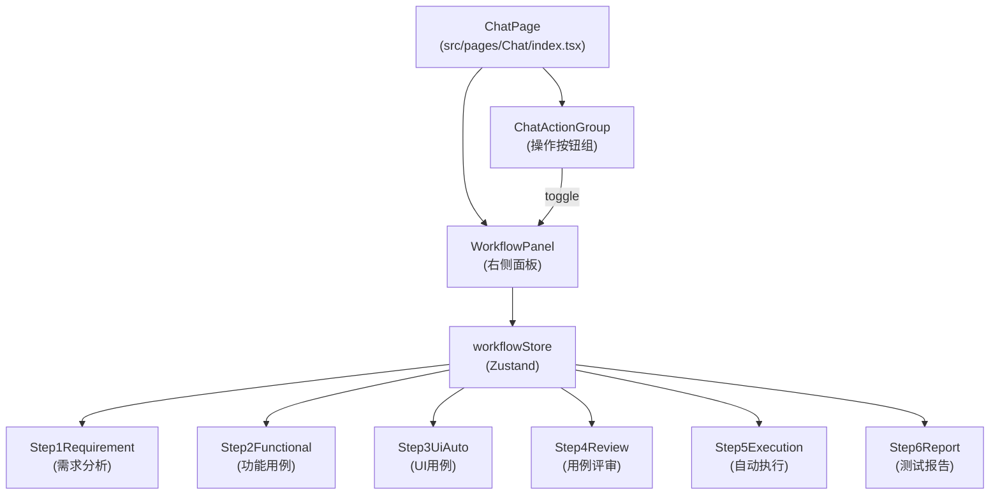
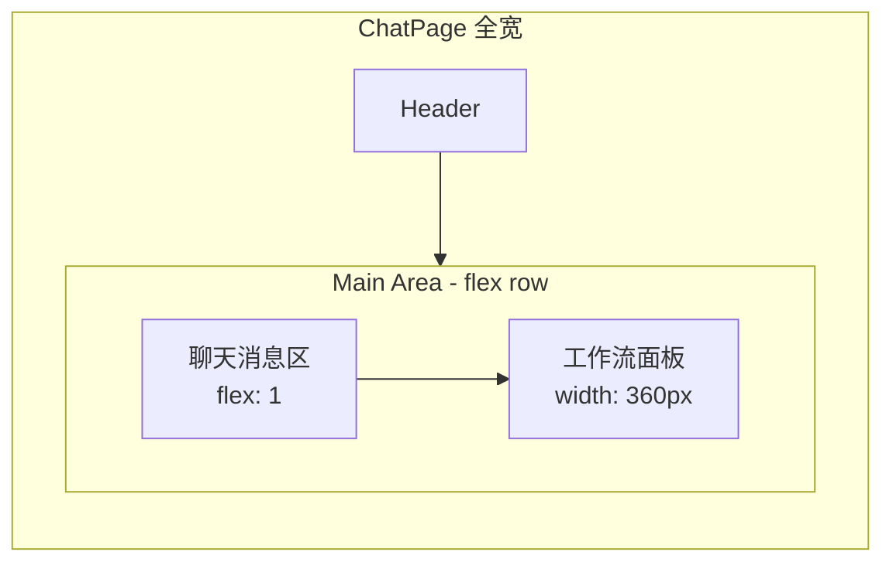

# 聊天页面右侧工作流面板设计

Feature Name: chat-workflow-panel
Updated: 2026-07-07

## Description

在 QwenPaw 聊天页面右侧添加测试工作流面板，以 6 阶段步骤卡展示测试流程各阶段产物。面板复用已有 `ChatSessionDrawer` 的 Embedded 模式，通过 Zustand 管理状态，通过 DOM 事件与聊天消息联动。

## Architecture

### 组件架构图



### 布局结构图



## Components and Interfaces

### WorkflowPanel 主组件

```tsx
interface WorkflowPanelProps {
  open: boolean;
  onClose: () => void;
  embedded?: boolean;  // 复用 ChatSessionDrawer 的模式
}

// 渲染逻辑
function WorkflowPanel({ open, onClose, embedded }: WorkflowPanelProps) {
  const { steps, currentStep, overallProgress } = useWorkflowStore();

  if (!open) return null;

  const panelContent = (
    <div className={styles.workflowPanelContent}>
      {/* 头部：标题 + 进度 */}
      <div className={styles.panelHeader}>
        <span>测试工作流</span>
        <Progress percent={overallProgress} size="small" />
      </div>

      {/* 6 个步骤 */}
      <Steps direction="vertical" size="small" current={currentStep}>
        {steps.map((step, idx) => (
          <Step key={step.id} status={step.status} title={step.name}>
            <StepBody step={step} />
          </Step>
        ))}
      </Steps>
    </div>
  );

  // Drawer 模式（移动端）
  if (!embedded) {
    return <Drawer open={open} onClose={onClose} placement="right" width={360}>
      {panelContent}
    </Drawer>;
  }

  // Embedded 模式（桌面端）
  return <div className={styles.embeddedPanel}>{panelContent}</div>;
}
```

### 单个步骤组件

```tsx
interface WorkflowStepItemProps {
  step: WorkflowStep;
  index: number;
}

function WorkflowStepItem({ step, index }: WorkflowStepItemProps) {
  const statusIcon = {
    pending: <DotOutlined />,
    running: <LoadingOutlined spin />,
    completed: <CheckCircleOutlined style={{ color: '#52c41a' }} />,
    error: <CloseCircleOutlined style={{ color: '#ff4d4f' }} />,
    skipped: <MinusCircleOutlined style={{ color: '#999' }} />,
  }[step.status];

  return (
    <div className={classNames(styles.stepItem, {
      [styles.active]: step.status === 'running',
      [styles.done]: step.status === 'completed',
    })}>
      <div className={styles.stepHeader}>
        {statusIcon}
        <span className={styles.stepName}>{step.name}</span>
        {step.result?.count && <Badge count={step.result.count} />}
      </div>
      {step.status === 'completed' && <StepArtifactPreview step={step} />}
      {step.error && <Alert type="error" message={step.error} banner />}
    </div>
  );
}
```

### Zustand Store

```tsx
import { create } from 'zustand';
import { persist } from 'zustand/middleware';

interface WorkflowState {
  steps: WorkflowStep[];
  currentStep: number;
  iterationId: string;
  overallProgress: number;
  
  // Actions
  updateStep: (stepId: string, update: Partial<WorkflowStep>) => void;
  resetWorkflow: () => void;
  goToStep: (index: number) => void;
  syncFromChatMessage: (message: ChatMessage) => void;
}

const DEFAULT_STEPS: WorkflowStep[] = [
  { id: 'requirement', name: '需求分析', status: 'pending', result: {} },
  { id: 'functional', name: '生成功能用例', status: 'pending', result: {} },
  { id: 'ui-auto', name: '生成UI用例', status: 'pending', result: {} },
  { id: 'review', name: '用例评审', status: 'pending', result: {} },
  { id: 'execution', name: '自动测试执行', status: 'pending', result: {} },
  { id: 'report', name: '端到端测试报告', status: 'pending', result: {} },
];

export const useWorkflowStore = create<WorkflowState>()(
  persist(
    (set, get) => ({
      steps: DEFAULT_STEPS,
      currentStep: 0,
      iterationId: '',
      overallProgress: 0,

      updateStep: (stepId, update) => set(state => {
        const steps = state.steps.map(s =>
          s.id === stepId ? { ...s, ...update } : s
        );
        const completedCount = steps.filter(s => s.status === 'completed').length;
        return {
          steps,
          overallProgress: Math.round((completedCount / steps.length) * 100),
        };
      }),

      resetWorkflow: () => set({
        steps: DEFAULT_STEPS,
        currentStep: 0,
        overallProgress: 0,
      }),

      goToStep: (index) => set({ currentStep: index }),

      syncFromChatMessage: (message) => {
        // 解析 AI 消息中的 tool_call 结果，更新对应步骤
        // 监听 window 自定义事件 'workflow-step-update'
      },
    }),
    {
      name: 'workflow-state',
      partialize: (state) => ({
        steps: state.steps,
        currentStep: state.currentStep,
        iterationId: state.iterationId,
        overallProgress: state.overallProgress,
      }),
    }
  )
);
```

## Data Models

### WorkflowStep 数据模型

```ts
interface WorkflowStep {
  id: 'requirement' | 'functional' | 'ui-auto' | 'review' | 'execution' | 'report';
  name: string;
  status: 'pending' | 'running' | 'completed' | 'error' | 'skipped';
  result: StepResult;       // 各步骤不同的产物数据
  error?: string;
  startedAt?: string;       // ISO 8601
  completedAt?: string;
}

// 各步骤的产物数据结构
interface RequirementResult {
  modules: number;
  flows: { name: string; stepCount: number }[];
  rules: number;
  exceptions: number;
  nonFunctional: number;
  risks: number;
}

interface FunctionalResult {
  storyCount: number;
  caseCount: number;
  coverage: number;         // 0-100
  byType: { functional: number; boundary: number; exception: number; security: number };
  byPriority: { high: number; medium: number; low: number };
}

interface UiAutoResult {
  pageObjects: number;
  totalSteps: number;
  pages: string[];
  selectorStability?: number;
}

interface ReviewResult {
  totalCases: number;
  passed: number;
  failed: number;
  issues: { high: number; medium: number; low: number };
  issueTypes: string[];
}

interface ExecutionResult {
  total: number;
  passed: number;
  failed: number;
  skipped: number;
  duration: number;         // seconds
  currentRunning?: string;
}

interface ReportResult {
  total: number;
  passed: number;
  failed: number;
  skipped: number;
  passRate: number;         // 0-100
  defects: { critical: number; major: number; minor: number; trivial: number };
  duration: number;
  previousPassRate?: number;
}
```

## Workflow State Persistence (库表保存)

### 存储路径

```
workspace/test/iteration/{iterationId}/
├── workflow.json              # 工作流主状态（各步骤状态、产物摘要）
├── workflow_events.jsonl      # 事件日志（用于审计与回放）
├── prd/prd_result.json        # 步骤1 原始 PRD 解析结果
├── story/stories.json         # 步骤2 Story 列表
├── case/cases.json            # 步骤2 Case 列表
├── ui-auto/elements.json      # 步骤3 UI 元素库
├── review/review_result.json  # 步骤4 评审结果
├── exec/run_result.json       # 步骤5 执行结果
└── report/report.json         # 步骤6 测试报告
```

### WorkflowStore 后端实现

```python
# models/workflow_state.py
class WorkflowStepRecord(BaseModel):
    step_id: str
    name: str
    status: str  # pending | running | completed | error | skipped
    result_summary: dict = Field(default_factory=dict)
    error: Optional[str] = None
    started_at: Optional[datetime] = None
    completed_at: Optional[datetime] = None

class WorkflowState(BaseModel):
    iteration_id: str
    chat_session_id: Optional[str] = None
    steps: list[WorkflowStepRecord] = Field(default_factory=list)
    overall_progress: int = 0  # 0-100
    updated_at: datetime = Field(default_factory=datetime.utcnow)

# storage/file_stores.py（新增）
class FileWorkflowStore(BaseStore[WorkflowState]):
    """工作流状态持久化存储（文件模式，复用现有框架）。"""

    def __init__(self, workspace_dir: str):
        self._root = Path(workspace_dir) / "test" / "iteration"

    def _path(self, iteration_id: str) -> Path:
        return self._root / iteration_id / "workflow.json"

    async def update_step(self, iteration_id: str, step_id: str, update: dict) -> WorkflowState:
        state = await self.get(iteration_id) or WorkflowState(iteration_id=iteration_id)
        # 查找并更新对应 step
        found = False
        for step in state.steps:
            if step.step_id == step_id:
                step = step.model_copy(update=update)
                if update.get("status") == "completed":
                    step.completed_at = datetime.utcnow()
                found = True
                break
        if not found:
            state.steps.append(WorkflowStepRecord(step_id=step_id, **update))
        # 重新计算进度
        completed = sum(1 for s in state.steps if s.status == "completed")
        state.overall_progress = round((completed / 6) * 100)
        state.updated_at = datetime.utcnow()
        await self.save(state)
        return state

    async def reset_workflow(self, iteration_id: str) -> WorkflowState:
        state = WorkflowState(iteration_id=iteration_id)
        await self.save(state)
        return state
```

### 聊天触发同步机制

当 Agent tool_call 完成后主动调用的内部 API `POST /api/test/workflow/update`：

```python
# routers/workflow.py
@router.post("/update")
async def update_workflow_step(body: dict):
    """Agent/前端调用，更新工作流步骤状态。"""
    from storage.file_stores import FileWorkflowStore
    from common.paths import get_workspace_dir

    store = FileWorkflowStore(get_workspace_dir())
    state = await store.update_step(
        iteration_id=body["iteration_id"],
        step_id=body["step_id"],
        update={
            "name": body.get("name", ""),
            "status": body["status"],
            "result_summary": body.get("result_summary", {}),
            "error": body.get("error"),
            "started_at": body.get("started_at"),
        }
    )
    return {"iteration_id": state.iteration_id, "overall_progress": state.overall_progress, "steps": [s.model_dump() for s in state.steps]}

@router.get("/{iteration_id}")
async def get_workflow_state(iteration_id: str):
    from storage.file_stores import FileWorkflowStore
    from common.paths import get_workspace_dir
    store = FileWorkflowStore(get_workspace_dir())
    state = await store.get(iteration_id)
    if not state:
        return {"iteration_id": iteration_id, "steps": [], "overall_progress": 0}
    return state.model_dump()

@router.post("/{iteration_id}/reset")
async def reset_workflow(iteration_id: str):
    from storage.file_stores import FileWorkflowStore
    from common.paths import get_workspace_dir
    store = FileWorkflowStore(get_workspace_dir())
    state = await store.reset_workflow(iteration_id)
    return {"iteration_id": state.iteration_id, "overall_progress": 0, "steps": []}
```

### MySQL 模式（可选）

```sql
-- 工作流状态表
CREATE TABLE test_workflow_state (
    id              VARCHAR(64) PRIMARY KEY AUTO_INCREMENT,
    iteration_id    VARCHAR(64) NOT NULL,
    chat_session_id VARCHAR(128),
    overall_progress TINYINT DEFAULT 0,
    updated_at      DATETIME DEFAULT CURRENT_TIMESTAMP ON UPDATE CURRENT_TIMESTAMP,
    INDEX idx_iteration (iteration_id)
);

-- 步骤记录表
CREATE TABLE test_workflow_step (
    id              VARCHAR(64) PRIMARY KEY AUTO_INCREMENT,
    iteration_id    VARCHAR(64) NOT NULL,
    step_id         VARCHAR(32) NOT NULL,
    name            VARCHAR(128),
    status          ENUM('pending','running','completed','error','skipped') DEFAULT 'pending',
    result_summary  JSON,
    error           TEXT,
    started_at      DATETIME,
    completed_at    DATETIME,
    UNIQUE KEY uk_iteration_step (iteration_id, step_id),
    INDEX idx_status (status)
);
```

对应 `storage/mysql_stores.py` 新增 `MysqlWorkflowStore` 类，接口与 `FileWorkflowStore` 一致，通过 `StorageFactory` 按需选择。

---

## Knowledge Base Archival (知识库保存)

### 归档时机

| 工作流事件 | 知识库动作 | 产品类型 |
|-----------|-----------|---------|
| 需求分析完成 | 归档 PRD 解析摘要 → 知识文档 | `prd_summary` |
| 功能用例完成 | 归档 Story + Case 拓扑 → 知识文档 | `case_pattern` |
| UI 用例完成 | 归档页面对象模型 → 知识文档 | `ui_pattern` |
| 用例评审完成 | 归档评审问题模式 → 知识文档 | `review_finding` |
| 测试执行完成 | 归档失败执行摘要 → 知识文档 | `execution_insight` |
| 测试报告完成 | 归档关键报告指标 → 知识文档 | `test_report` |

### 知识库模型扩展

```python
# models/knowledge.py — 新增 doc_type 枚举
KNOWLEDGE_DOC_TYPES = [
    "general",           # 通用
    "prd_summary",       # PRD 解析摘要
    "case_pattern",      # 用例模式
    "ui_pattern",        # UI 自动化模式
    "review_finding",    # 评审发现
    "execution_insight", # 执行洞察
    "test_report",       # 测试报告
]

# 模型无需修改，新增 doc_type 值即可
```

### 归档 Agent

```python
# agents/workflow_archive_agent.py
class WorkflowArchiveAgent:
    """工作流产物归档 Agent，在各步骤完成后自动将摘要写入知识库。"""

    def __init__(self, workspace_dir: str):
        self._workspace_dir = workspace_dir

    async def archive_step_result(self, iteration_id: str, step_id: str, result: dict) -> dict:
        """将工作流步骤产物归档为知识库文档。"""

        ARCHIVE_HANDLERS = {
            "requirement": self._archive_requirement,
            "functional": self._archive_functional,
            "ui-auto": self._archive_ui_auto,
            "review": self._archive_review,
            "execution": self._archive_execution,
            "report": self._archive_report,
        }

        handler = ARCHIVE_HANDLERS.get(step_id)
        if not handler:
            return {"status": "skipped", "reason": "no handler"}

        doc = await handler(iteration_id, result)
        # 写入知识库
        store = FileKnowledgeStore(self._workspace_dir)
        await store.create(doc)
        # 自动索引到 RAG（调用平台原生 ReMe 接口）
        await self._index_to_rag(doc)
        return {"status": "ok", "doc_id": doc.id, "doc_type": doc.doc_type}

    async def _archive_requirement(self, iteration_id: str, result: dict) -> KnowledgeDocument:
        return KnowledgeDocument(
            title=f"PRD 解析摘要 [{iteration_id}]",
            content=self._format_requirement_content(result),
            doc_type="prd_summary",
            tags=["prd", "requirement", iteration_id],
            iteration_id=iteration_id,
        )

    async def _archive_functional(self, iteration_id: str, result: dict) -> KnowledgeDocument:
        return KnowledgeDocument(
            title=f"用例模式 [{iteration_id}]",
            content=self._format_case_content(result),
            doc_type="case_pattern",
            tags=["case", "functional", iteration_id],
            iteration_id=iteration_id,
        )

    async def _archive_ui_auto(self, iteration_id: str, result: dict) -> KnowledgeDocument:
        return KnowledgeDocument(
            title=f"UI 自动化模式 [{iteration_id}]",
            content=self._format_ui_content(result),
            doc_type="ui_pattern",
            tags=["ui", "automation", iteration_id],
            iteration_id=iteration_id,
        )

    async def _archive_review(self, iteration_id: str, result: dict) -> KnowledgeDocument:
        return KnowledgeDocument(
            title=f"用例评审发现 [{iteration_id}]",
            content=self._format_review_content(result),
            doc_type="review_finding",
            tags=["review", "quality", iteration_id],
            iteration_id=iteration_id,
        )

    async def _archive_execution(self, iteration_id: str, result: dict) -> KnowledgeDocument:
        return KnowledgeDocument(
            title=f"执行洞察 [{iteration_id}]",
            content=self._format_execution_content(result),
            doc_type="execution_insight",
            tags=["execution", "failure-analysis", iteration_id],
            iteration_id=iteration_id,
        )

    async def _archive_report(self, iteration_id: str, result: dict) -> KnowledgeDocument:
        return KnowledgeDocument(
            title=f"测试报告 [{iteration_id}]",
            content=self._format_report_content(result),
            doc_type="test_report",
            tags=["report", "quality-metrics", iteration_id],
            iteration_id=iteration_id,
        )

    async def _index_to_rag(self, doc: KnowledgeDocument):
        """调用平台 ReMe 向量存储接口进行索引。"""
        try:
            from qwenpaw.agents.memory.reme_light_memory_manager import ReMeLightMemoryManager
            # 通过平台原生接口写入向量库（具体调用方式参考 ReMe API）
            pass
        except Exception:
            pass  # 知识库写入失败不影响工作流
```

### 触发机制

在 `POST /api/test/workflow/update` 接口中，当步骤状态变为 `completed` 时自动触发归档：

```python
@router.post("/update")
async def update_workflow_step(body: dict):
    # ... 更新状态 ...

    # 步骤完成时自动归档到知识库
    if body["status"] == "completed" and body.get("result_summary"):
        try:
            from agents.workflow_archive_agent import WorkflowArchiveAgent
            agent = WorkflowArchiveAgent(get_workspace_dir())
            archive_result = await agent.archive_step_result(
                iteration_id=body["iteration_id"],
                step_id=body["step_id"],
                result=body["result_summary"],
            )
            # 将 archive 结果附加到返回值
            response["archive"] = archive_result
        except Exception as e:
            logger.warning(f"Knowledge archival failed for step {body['step_id']}: {e}")
```

---

## Correctness Properties

1. **状态一致性**: 面板状态与聊天消息中的 tool_call 结果严格一致，不会多播或丢失
2. **默认折叠**: 面板默认不阻挡聊天视图，用户主动展开后才可见
3. **步骤顺序**: 步骤按照固定顺序执行，不允许跳过中间步骤（但可手动重置）
4. **产物联级清理**: 重置上游步骤时，下游步骤自动重置为 `pending`
5. **知识库幂等**: 同一 iteration 同一步骤的重复归档自动去重（基于 `iteration_id + step_id` 唯一键）

## Error Handling

| 场景 | 处理方式 |
|------|---------|
| API 调用超时 | 步骤状态 → `error`，显示"请求超时，点击重试" |
| API 返回错误 | 步骤状态 → `error`，显示错误摘要 |
| 网络断连 | 面板显示离线标记，恢复后自动重试 |
| 历史会话产物不存在 | 显示"数据已清理"状态，不再展示无效数字 |

## Test Strategy

1. **单元测试**: 验证 Zustand store 的 `updateStep`/`resetWorkflow` 逻辑
2. **集成测试**: 模拟 6 个步骤的 tool_call 事件流，验证面板状态同步
3. **视觉回归**: 截面板在各种状态（全 pending、全完成、混合）下的截图
4. **响应式验证**: 桌面端 embedded 模式 / 移动端 Drawer 模式切换
