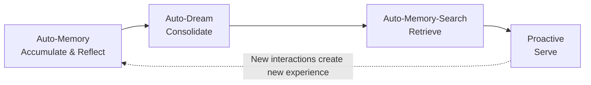

# Agent Memory-Evolving & Proactive Interaction (Beta)

> **Beta Feature**: Agent Memory-Evolving & Proactive Interaction is an experimental capability available in QwenPaw versions after 1.1.4beta1. We have been exploring "memory-driven experience loops" and this feature is still under active iteration. If you have any ideas or suggestions, please share them on [GitHub](https://github.com/agentscope-ai/QwenPaw/issues) to help us improve.

QwenPaw agents achieve continuous evolution without model fine-tuning—through a **memory-driven experience loop**, they get smarter the more they use. The core idea: let the Agent accumulate experience from each interaction, periodically reflect and distill, proactively retrieve and reuse, and ultimately build personalized service capabilities—moving from passive response to proactive service.

---

## The Evolution Loop

Memory evolution is not a single feature, but a loop formed by four modules working together:



| Phase           | Module             | Core Function                                                                         | Default | Analogy                      |
| --------------- | ------------------ | ------------------------------------------------------------------------------------- | ------- | ---------------------------- |
| **Accumulate**  | Auto-Memory        | Comprehensive summary: facts + experience reflection + improvement directions         | Off     | Writing a diary              |
| **Consolidate** | Auto-Dream         | Remove noise, resolve conflicts, distill into structured knowledge                    | On      | Weekly review                |
| **Retrieve**    | Auto-Memory-Search | Help weaker models proactively retrieve relevant experience, auto-inject into context | Off     | Flipping through notes       |
| **Serve**       | Proactive          | Push valuable information based on personalized memory                                | Off     | Assistant anticipating needs |

The four phases form a positive loop: new interactions from Proactive are captured by Auto-Memory, fueling the next round of evolution.

---

## Quick Start

Recommended configuration for the complete evolution pipeline:

| Step | Action                                   | Config Path                                                          | Description                                     |
| ---- | ---------------------------------------- | -------------------------------------------------------------------- | ----------------------------------------------- |
| 1    | Enable Auto-Memory, set interval to 3–10 | Workspace → Running Config → Long-term Memory → Auto Memory Interval | Accumulate experience during the day            |
| 2    | Keep Auto-Dream enabled (default)        | Workspace → Running Config → Long-term Memory → Dream                | Consolidate overnight (default: 11 PM)          |
| 3    | Enable Auto-Memory-Search                | Workspace → Running Config → Long-term Memory → Auto Memory Search   | Reuse experience automatically in conversations |
| 4    | Enable Proactive as needed               | Type `/proactive` in any session                                     | Push valuable info when idle                    |

> **One-line summary**: Record as you go → Consolidate regularly → Use immediately → Serve proactively. Through this loop, the Agent evolves continuously without changing the model.

---

## Step 1: Experience Accumulation (Auto-Memory)

Auto-Memory is the starting point of evolution. It enables the Agent to produce comprehensive summaries—not just remembering what happened, but **reflecting on how to do better next time**. This is the core of memory evolution: every interaction is a learning opportunity.

### What to Record

| Category                  | Content                                                                                                                                           | Examples                                                                                                                           |
| ------------------------- | ------------------------------------------------------------------------------------------------------------------------------------------------- | ---------------------------------------------------------------------------------------------------------------------------------- |
| **Factual Memory**        | Objective facts, user profile updates, project states, important events                                                                           | "User prefers Chinese communication", "Project uses PostgreSQL", "Merged PR #3466 today"                                           |
| **Experience Reflection** | Reusable thinking logic from user feedback, successful problem-solving strategies, pitfalls to avoid, actionable insights for future interactions | "Sina Finance API is most reliable for stock prices", "Don't skip tests", "Confirm requirements before starting this type of task" |

Experience reflection is the key to memory evolution—its core goal is to **build reusable cognitive frameworks to improve future task execution**. The Agent distills "what I did" into "how I do it", evolving from "I did this" to "I'll do this better next time".

### How to Record

Auto-Memory doesn't simply append new content—it performs **intelligent merging** with the day's existing memory file:

- **Clear categorization**: Explicitly separates "Factual Memory" from "Reflections & Logic"
- **Avoid duplication**: Already recorded information won't be written again
- **Enrich details**: Existing entries are supplemented with new relevant information
- **Maintain chronology**: Preserves timestamps and chronological order where applicable
- **Concise yet complete**: Only adds genuinely new or meaningfully enriching information

If there's nothing new to store or reflect on, Auto-Memory silently skips (responds with `[SILENT]`), consuming no extra tokens.

### When to Record

| Trigger    | Config                   | Description                            | Default |
| ---------- | ------------------------ | -------------------------------------- | ------- |
| Periodic   | `auto_memory_interval`   | Auto-summarize every N user messages   | 1       |
| On compact | `summarize_when_compact` | Save memory before context compression | On      |

Periodic Auto-Memory is enabled by default with interval `1`. Set it to `null`
or `0` to disable periodic extraction:

> **Config path**: Workspace → Running Config → Long-term Memory → Auto Memory Interval

**Recommendation**: Keep `1` for aggressive experience accumulation, or set to 3–10 for a reflection summary every 3–10 conversation turns. Higher frequency means faster experience accumulation but higher token cost. This process runs in the background and doesn't affect the current conversation.

---

## Step 2: Memory Consolidation (Auto-Dream)

Daily accumulated memories inevitably contain duplicates, conflicts, and unstructured content. Auto-Dream is **enabled by default**, running automatically at 11 PM every night to "crystallize" raw memories into high-quality knowledge. Once-a-day consolidation keeps token costs manageable.

> **Config path**: Workspace → Running Config → Long-term Memory → Dream

### Five Optimization Principles

| Principle             | What It Does                                                                    |
| --------------------- | ------------------------------------------------------------------------------- |
| **Remove noise**      | Delete temporary details, one-off task records                                  |
| **Preserve essence**  | Keep only core decisions, confirmed preferences, reusable insights              |
| **Resolve conflicts** | Overwrite outdated information with latest state                                |
| **Create structure**  | Organize scattered notes into coherent principles                               |
| **Backup protection** | Automatic backup before each optimization, enabling historical version recovery |

### Consolidation Results

Optimized content is written to `{workspace}/MEMORY.md`, containing three types of high-value information:

- Core business decisions
- Confirmed user preferences
- High-value reusable experiences

> **Note**: `MEMORY.md` is not included in context by default. To let the Agent use it automatically in conversations, go to **Workspace → Files** and enable the MEMORY.md switch to always load it into context.

---

## Step 3: Experience Retrieval (Auto-Memory-Search)

After accumulation and consolidation, the key is to **let the Agent actively use this experience**. However, in practice, weaker models often don't proactively call memory search tools—they won't voluntarily dig through historical experience when needed. Auto-Memory-Search solves this: **it automatically retrieves relevant memories before each conversation turn and injects them into the reasoning context**, helping weaker models make good use of memory too.

### Workflow

```
User sends message
    ↓
Extract message text as query (max 100 chars)
    ↓
Search MEMORY.md + memory/*.md
    ↓
Inject search results as completed tool calls into message history
    ↓
Agent reasons with historical experience in context
```

### Difference from Traditional RAG

Search results are injected as "completed tool calls" rather than appended to the system prompt. This **preserves KVCache integrity**, significantly improving token efficiency.

### Effect Comparison

Using "query Alibaba stock price" as an example:

| Status   | Performance                                                                         |
| -------- | ----------------------------------------------------------------------------------- |
| Disabled | 16 steps, trying different websites repeatedly                                      |
| Enabled  | 4 steps, directly reusing historical experience "Sina Finance API is most reliable" |

### Configuration

| Config        | Description                       | Default |
| ------------- | --------------------------------- | ------- |
| `enabled`     | Enable auto memory search         | `false` |
| `max_results` | Maximum results returned          | `2`     |
| `min_score`   | Minimum relevance score threshold | `0.3`   |

> **Note**: Disabled by default, must be enabled manually.

> **Config path**: Workspace → Running Config → Long-term Memory → Auto Memory Search → Turn on "Auto Memory Search (Beta)" switch. You can further configure max results and minimum relevance score.

---

## Step 4: Proactive Service (Proactive)

When the memory system is rich enough, the Agent can evolve from passive response to proactive service—predicting needs and pushing valuable information based on understanding of the user.

### Typical Scenarios

- Push latest updates on topics the user cares about (e.g., "today's stock market")
- Retry unfinished tasks from historical sessions
- Supplement information for ongoing work (e.g., related academic research)
- Detect when the user is working on a PR and proactively provide code review feedback

### How It Works

**Disabled by default**, enabling it will increase token consumption. Enable via slash command:

```
/proactive          # Use default interval (trigger after 30 min idle)
/proactive 15       # Trigger after 15 min idle
/proactive off      # Disable proactive service
```

Triggers after the app has been idle for the specified time. Workflow:

1. **Memory aggregation** — Extract recent conversations, user interests, unfinished tasks
2. **Need prediction** — Infer potential needs from context
3. **Information retrieval & push** — Call tools to fetch latest info, generate proactive messages

Push messages are prefixed with `[PROACTIVE]` and sent to a dedicated session.

### Anti-Disturbance Strategy

- After a push, if the user doesn't respond, the system **won't repeatedly trigger the same content**
- Only provides information/suggestions/reminders—no high-risk operations (no file modifications, no network requests)

### Usage

| Command          | Description                                                                      |
| ---------------- | -------------------------------------------------------------------------------- |
| `/proactive`     | Enable proactive service, default trigger after 30 min idle (current Agent only) |
| `/proactive 15`  | Enable proactive service, trigger after 15 min idle                              |
| `/proactive off` | Disable proactive service                                                        |

---

## Roadmap

Current memory evolution capabilities are built on [ReMe](https://github.com/agentscope-ai/ReMe)'s ReMeLight implementation. ReMe is undergoing a major code refactoring that will bring qualitative improvements to memory evolution:

### Finer-Grained Memory Classification

Memory is no longer a simple "facts vs. reflections" dichotomy—it's split into three types:

| Memory Type    | Description                                                  | Evolution Value                 |
| -------------- | ------------------------------------------------------------ | ------------------------------- |
| **Personal**   | User preferences, habits, personal information               | Personalization                 |
| **Procedural** | Methods, workflows, lessons learned                          | Core driver of memory evolution |
| **Knowledge**  | Domain knowledge, project documentation, technical solutions | Knowledge base building         |

### Differentiated Creation & Update Strategies

Different memory types have different lifecycles and update logic. After refactoring, each type will have its own creation and update strategy:

| Memory Type    | Creation Strategy                                   | Update Strategy                                                                                                              |
| -------------- | --------------------------------------------------- | ---------------------------------------------------------------------------------------------------------------------------- |
| **Personal**   | Auto-created when user first expresses a preference | Overwrite-updated when preference changes, keeping latest state                                                              |
| **Procedural** | Created when a new method is discovered             | Self-updates when existing method is verified better or issues exposed, forming a "create → verify → update" evolution cycle |
| **Knowledge**  | Created when new domain knowledge is encountered    | Incrementally updated as knowledge evolves, maintaining consistency through graph associations                               |

This differentiated strategy ensures each memory type grows and evolves in the most appropriate way, rather than applying a one-size-fits-all approach. Procedural memory will have its own dedicated Summarizer, specifically focused on distilling "how to do better" experience—this is the core driver of memory evolution.

### Knowledge Graph

Knowledge-type memory will support **Graph Markdown** format, building structured knowledge graphs. The Agent will no longer just "remember a bunch of scattered information"—it will establish relationships between pieces of information, forming a reasoning-capable knowledge network.

All modules (Auto-Memory, Auto-Dream, Auto-Memory-Search, Proactive) will be refactored under ReMe's new framework, gaining better architectural support and a more consistent experience.
