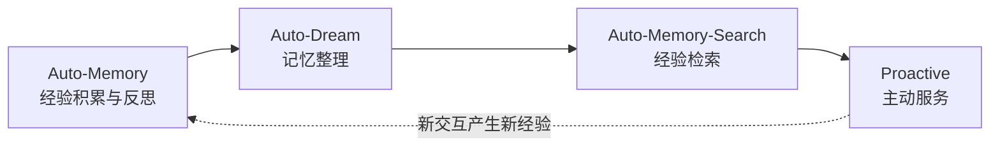

# 智能体记忆进化与主动交互(Beta)

> **Beta 功能**：智能体记忆进化与主动交互是 QwenPaw 在 1.1.4beta1 之后版本中提供的实验性能力。我们围绕"记忆驱动的经验闭环"
>
> 做了一些探索，目前仍处于持续迭代阶段。如果你在使用中有任何想法或建议，欢迎在 [GitHub](https://github.com/agentscope-ai/QwenPaw/issues)
> 提出，帮助我们把它做得更好。

QwenPaw 的智能体不依赖模型微调，而是通过**记忆驱动的经验闭环**实现持续进化——越用越聪明，并在此基础上实现主动交互。核心思路是：让
Agent 在每次交互中积累经验、定期反思提炼、主动检索复用、最终形成个性化服务能力，从被动响应走向主动服务。

---

## 进化闭环

记忆进化并非单一功能，而是四个模块协同形成的闭环：



| 阶段     | 模块               | 核心作用                                   | 默认状态 | 类比         |
| -------- | ------------------ | ------------------------------------------ | -------- | ------------ |
| **积累** | Auto-Memory        | 全面总结：事实 + 经验反思 + 改进方向       | 关闭     | 写日记       |
| **整理** | Auto-Dream         | 去噪、去矛盾、提炼为结构化知识             | 开启     | 定期复盘     |
| **检索** | Auto-Memory-Search | 帮助弱模型主动检索相关经验，自动注入上下文 | 关闭     | 翻笔记       |
| **服务** | Proactive          | 基于个性化记忆主动推送有价值信息           | 关闭     | 助手预判需求 |

四个阶段形成正向循环：Proactive 产生的新交互又被 Auto-Memory 沉淀，推动下一轮进化。

---

## 快速上手

推荐的完整进化链路配置：

| 步骤 | 操作                              | 配置路径                                    | 说明                           |
| ---- | --------------------------------- | ------------------------------------------- | ------------------------------ |
| 1    | 开启 Auto-Memory，设置间隔为 3~10 | 工作区 → 运行配置 → 长期记忆 → 自动记忆间隔 | 白天积累经验                   |
| 2    | 保持 Auto-Dream 默认开启          | 工作区 → 运行配置 → 长期记忆 → 梦境         | 夜间整理结晶（默认每晚 11 点） |
| 3    | 开启 Auto-Memory-Search           | 工作区 → 运行配置 → 长期记忆 → 自动记忆搜索 | 对话时自动复用经验             |
| 4    | 按需开启 Proactive                | 在会话中输入 `/proactive`                   | 空闲时主动推送有价值信息       |

> **一句话总结**：边做边记 → 定期整理 → 马上能用 → 主动服务。Agent 通过这个闭环，在不改模型的情况下持续进化。

---

## 第一步：经验积累（Auto-Memory）

Auto-Memory 是进化的起点。它让 Agent 做更加全面的总结——**不仅仅是记住之前发生了什么，更重要的是总结之前做事的经验和反思，思考如何在下一次事情中做得更好
**。这是记忆进化的核心：每次交互都是一次学习机会。

### 记录什么

| 类别         | 内容                                                                                         | 示例                                                                            |
| ------------ | -------------------------------------------------------------------------------------------- | ------------------------------------------------------------------------------- |
| **事实记忆** | 客观事实、用户信息更新、项目状态及重要事件                                                   | "用户偏好中文交流"、"项目使用 PostgreSQL"、"今天完成了 PR #3466 的合并"         |
| **经验反思** | 基于用户反馈形成的可复用思考逻辑、成功的问题解决策略、应避免的陷阱，以及对未来交互的行动指南 | "查询股价用新浪财经 API 最可靠"、"不要跳过测试"、"这类任务应该先确认需求再动手" |

经验反思是记忆进化的关键——它的核心目标是**构建可复用的认知框架，以改善未来的任务执行**。Agent 从"做过的事"中提炼出"
做事的方法"，从"我做了什么"进化到"我下次怎么做更好"。

### 怎么记录

Auto-Memory 不是简单地追加新内容，而是与当日已有的记忆文件进行**智能合并**：

- **分类清晰**：明确区分"事实记忆"与"反思与逻辑"两大类
- **避免重复**：已记录的信息不会重复写入
- **丰富细节**：相关条目会用新信息补充完善
- **保持时序**：在适用时保持时间顺序，始终保留时间戳
- **简洁完整**：只添加真正新的或有丰富价值的信息，保持条目简洁但完整

如果没有新的内容可存储或反思，Auto-Memory 会静默跳过（回复 `[SILENT]`），不产生额外的 token 消耗。

### 何时记录

| 触发方式   | 配置项                   | 说明                         | 默认值 |
| ---------- | ------------------------ | ---------------------------- | ------ |
| 周期性触发 | `auto_memory_interval`   | 每 N 条用户消息后自动总结    | 1      |
| 压缩时触发 | `summarize_when_compact` | 上下文超阈值压缩前先保存记忆 | 开启   |

周期性 Auto-Memory 默认开启，间隔为 `1`。如需关闭周期性抽取，可设置为
`null` 或 `0`：

> **配置路径**：工作区 → 运行配置 → 长期记忆 → 自动记忆间隔

**配置建议**：保持 `1` 可更积极地积累经验；如希望降低频率，可设为
3~10，即每 3~10 轮对话进行一次反思总结。频率越高，经验积累越快，token
消耗也越大。此过程在后台自动执行，不影响当前对话体验。

---

## 第二步：记忆整理（Auto-Dream）

日常积累的记忆不可避免地包含重复、冲突和缺乏结构的内容。Auto-Dream **默认开启**，每天晚上 11 点自动执行一次，将原始记忆"
结晶化"为高质量知识。一天一次的整理频率，token 消耗相对可控。

> **配置路径**：工作区 → 运行配置 → 长期记忆 → 梦境

### 五大优化原则

| 原则         | 做了什么                                 |
| ------------ | ---------------------------------------- |
| **去除噪音** | 删除临时细节、一次性任务记录             |
| **保留精华** | 只保留核心决策、确认的偏好、可复用的洞察 |
| **解决矛盾** | 用最新状态覆盖过时信息                   |
| **创建结构** | 将零散笔记组织为连贯的原则               |
| **备份保护** | 每次优化前自动备份，可回溯历史版本       |

### 整理结果

优化后的内容写入 `{工作区}/MEMORY.md`，包含三类高价值信息：

- 核心业务决策
- 已确认的用户偏好
- 高价值可复用经验

> **注意**：`MEMORY.md` 默认不进入上下文。如需 Agent 在对话中自动使用，需在**工作区 → 文件**中手动开启MEMORY.md的开关，总是加载到上下文。

---

## 第三步：经验检索（Auto-Memory-Search）

积累和整理之后，关键在于**让 Agent 主动使用这些经验**。然而在实际使用中，弱模型往往不擅长主动调用记忆检索工具——它们不会在需要时自觉地去翻阅历史经验。Auto-Memory-Search 就是为了解决这个问题：**在每轮对话开始前自动检索相关记忆，注入推理上下文**，帮助弱模型也能用好记忆。

### 工作流程

```
用户发送消息
    ↓
提取消息文本作为查询（最多 100 字符）
    ↓
检索 MEMORY.md + memory/*.md
    ↓
将检索结果作为已完成的工具调用注入消息历史
    ↓
Agent 基于历史经验进行推理
```

### 与传统 RAG 的区别

检索结果以"已完成的工具调用"形式注入，而非拼接到 system prompt。这种方式**保持了 KVCache 的完整性**，显著提高 token 使用效率。

### 效果对比

以"查询阿里巴巴股价"为例：

| 状态   | 表现                                               |
| ------ | -------------------------------------------------- |
| 未开启 | 16 个 step，反复尝试不同网站                       |
| 已开启 | 4 个 step，直接复用"新浪财经 API 最可靠"的历史经验 |

### 配置项

| 配置项        | 说明                 | 默认值  |
| ------------- | -------------------- | ------- |
| `enabled`     | 是否开启自动记忆检索 | `false` |
| `max_results` | 最多返回的记忆条数   | `2`     |
| `min_score`   | 最低相关性分数阈值   | `0.3`   |

> **注意**：默认关闭，需手动开启。

> **配置路径**：工作区 → 运行配置 → 长期记忆 → 自动记忆搜索 → 打开「自动记忆搜索(Beta)」开关，可进一步设置最大结果数和最低相关性分数。

---

## 第四步：主动服务（Proactive）

当记忆系统足够丰富时，Agent 可以从被动响应进化为主动服务——基于对用户的理解，预测需求并推送有价值的信息。

### 典型场景

- 推送用户关心话题的最新进展（如"今日股市行情"）
- 重试历史会话中未完成的任务
- 为正在进行的工作补充信息（如相关学术调研）
- 感知用户正在处理 PR，主动提供代码审查意见

### 运行机制

**默认关闭**，开启后会增加额外的 token 消耗。通过超级命令开启：

```
/proactive          # 使用默认间隔（空闲 30 分钟后触发）
/proactive 15       # 设置空闲 15 分钟后触发
/proactive off      # 关闭主动服务
```

应用空闲指定时间后触发，整体流程：

1. **记忆聚合** — 提取近期对话、用户兴趣点、未完成任务
2. **需求预测** — 基于上下文推测潜在需求
3. **信息检索与推送** — 调用工具获取最新信息，生成主动消息

推送消息以 `[PROACTIVE]` 前缀标识，发送至专用 session。

### 防打扰策略

- 推送后若用户无操作，**不会重复触发相同内容**
- 仅提供信息/建议/提醒，不执行高风险操作（如修改文件、发送请求）

### 使用方式

| 操作             | 说明                                                        |
| ---------------- | ----------------------------------------------------------- |
| `/proactive`     | 开启主动服务，默认空闲 30 分钟后触发（仅对当前 Agent 生效） |
| `/proactive 15`  | 开启主动服务，设置空闲 15 分钟后触发                        |
| `/proactive off` | 关闭主动服务                                                |

---

## 后续规划

当前的记忆进化能力基于 [ReMe](https://github.com/agentscope-ai/ReMe) 的 ReMeLight 实现。ReMe
正在进行一次大规模代码重构，重构完成后将为记忆进化带来质的提升：

### 更精细的记忆分类

记忆不再只是"事实"与"反思"的二分法，而是细分为三类：

| 记忆类型       | 说明                         | 进化价值             |
| -------------- | ---------------------------- | -------------------- |
| **Personal**   | 用户偏好、习惯、个人信息     | 个性化服务能力       |
| **Procedural** | 做事的方法、流程、经验教训   | 记忆进化的核心驱动力 |
| **Knowledge**  | 领域知识、项目文档、技术方案 | 知识库建设           |

### 差异化的创建与更新策略

不同类型的记忆有不同的生命周期和更新逻辑，重构后将为每种类型实现专属的创建与更新方案：

| 记忆类型       | 创建策略                   | 更新策略                                                                 |
| -------------- | -------------------------- | ------------------------------------------------------------------------ |
| **Personal**   | 用户首次表达偏好时自动创建 | 偏好变化时覆盖更新，保留最新状态                                         |
| **Procedural** | 发现新的做事方法时创建     | 已有方法被验证更优或暴露问题时自更新，形成"创建 → 验证 → 更新"的进化循环 |
| **Knowledge**  | 遇到新的领域知识时创建     | 知识演进时增量更新，通过图谱关联保持一致性                               |

这种差异化策略确保每种记忆都能以最适合的方式生长和演进，而非一刀切地套用同一种逻辑。其中 Procedural 记忆将拥有专属的 Summarizer，专门提炼"怎么做更好"的经验——这是记忆进化的核心驱动力。

### Knowledge 知识图谱

Knowledge 类型记忆将支持 **Graph Markdown** 格式，构建结构化的知识图谱。Agent 不再只是"记住了一堆零散信息"，而是建立起信息之间的关联关系，形成可推理的知识网络。

以上所有模块（Auto-Memory、Auto-Dream、Auto-Memory-Search、Proactive）都将在 ReMe 新框架下统一重构，获得更好的架构支撑和更一致的体验。
