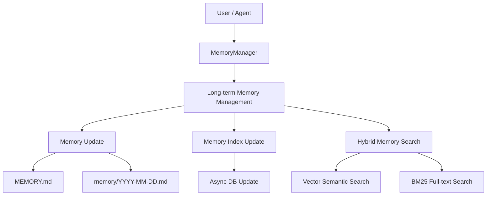
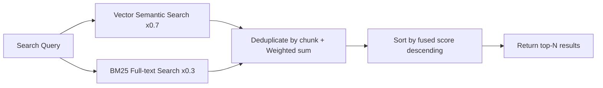

# Long-term Memory

**Long-term Memory** gives QwenPaw persistent memory across conversations: writes key information to Markdown files for
long-term storage, with semantic search for recall at any time.

> The long-term memory mechanism is inspired by [OpenClaw](https://github.com/openclaw/openclaw) and implemented via **ReMeLight** from [ReMe](https://github.com/agentscope-ai/ReMe) — a file-based memory backend where memories are plain Markdown files that can be read, edited, and migrated directly.

---

## Architecture Overview



Long-term memory management includes the following capabilities:

| Capability             | Description                                                                                                        |
| ---------------------- | ------------------------------------------------------------------------------------------------------------------ |
| **Memory Persistence** | Writes key information to Markdown files via file tools (`read` / `write` / `edit`); files are the source of truth |
| **File Watching**      | Monitors file changes via `watchfile`, asynchronously updating the local database (semantic index & vector index)  |
| **Semantic Search**    | Recalls relevant memories by semantics using vector embeddings + BM25 hybrid search                                |
| **File Reading**       | Reads the corresponding Memory Markdown files directly via file tools, loading on demand to keep the context lean  |
| **Dream Optimization** | Automatically optimizes MEMORY.md at scheduled intervals, removing redundancy and preserving high-quality memories |

---

## Memory File Structure

Memories are stored as plain Markdown files, operated directly by the Agent via file tools. The default workspace uses the following hierarchical structure:

```
{workspace}/
├── MEMORY.md              ← Auto-Dream optimized long-term memory (crystallized)
│   Contains: Core decisions, user preferences, reusable experiences
│
├── memory/                ← Auto-Memory written daily memories (raw records)
│   ├── 2026-04-20.md
│   ├── 2026-04-21.md      ← Auto-Dream reads today's log
│   └── ...
│
└── backup/                ← Auto-Dream created backups
    ├── memory_backup_20260421_230000.md
    └── ...                ← Can be used to restore historical versions
```

### MEMORY.md (Long-term Memory, Optional)

Stores long-lasting, rarely changing key information.

- **Location**: `{working_dir}/MEMORY.md`
- **Purpose**: Stores decisions, preferences, persistent facts and reusable experiences
- **Updates**: Written by the Agent via `write` / `edit` file tools, or automatically optimized by **Auto-Dream**

### memory/YYYY-MM-DD.md (Daily Log)

One page per day, appended with the day's work and interactions.

- **Location**: `{working_dir}/memory/YYYY-MM-DD.md`
- **Purpose**: Records daily notes and runtime context
- **Updates**: Appended by the Agent via `write` / `edit` file tools; automatically triggered when conversations become
  too long and need summarization
- **Role**: Serves as input source for **Auto-Dream** optimization

### backup/ (Backup Directory)

Stores backups of MEMORY.md created before each Auto-Dream optimization.

- **Location**: `{working_dir}/backup/`
- **Purpose**: Automatic backup before each Auto-Dream execution, enabling historical version recovery
- **Naming format**: `memory_backup_YYYYMMDD_HHMMSS.md`

> For a complete walkthrough of Auto-Memory, Auto-Dream, Auto-Memory-Search, and Proactive, see [Memory-Evolving & Proactive Interaction](./memory-evolving-and-proactive.en.md). The sections below cover technical implementation details and configuration only.

---

## Searching Memory

The Agent has two ways to retrieve past memories:

| Method          | Tool            | Use Case                                                    | Example                                        |
| --------------- | --------------- | ----------------------------------------------------------- | ---------------------------------------------- |
| Semantic search | `memory_search` | Unsure which file contains the info; fuzzy recall by intent | "Previous discussion about deployment process" |
| Direct read     | `read_file`     | Known specific date or file path; precise lookup            | Read `memory/2025-02-13.md`                    |

### Hybrid Search Explained

Memory search uses **Vector + BM25 hybrid search** by default. The two search methods complement each other's strengths.

#### Vector Semantic Search

Maps text into a high-dimensional vector space and measures semantic distance via cosine similarity, capturing content
with similar meaning but different wording:

| Query                                   | Recalled Memory                                           | Why It Matches                                                  |
| --------------------------------------- | --------------------------------------------------------- | --------------------------------------------------------------- |
| "Database choice for the project"       | "Finally decided to replace MySQL with PostgreSQL"        | Semantically related: both discuss database technology choices  |
| "How to reduce unnecessary rebuilds"    | "Configured incremental compilation to avoid full builds" | Semantic equivalence: reduce rebuilds ≈ incremental compilation |
| "Performance issue discussed last time" | "Optimized P99 latency from 800ms to 200ms"               | Semantic association: performance issue ≈ latency optimization  |

However, vector search is weaker on **precise, high-signal tokens**, as embedding models tend to capture overall
semantics rather than exact matches of individual tokens.

#### BM25 Full-text Search

Based on term frequency statistics for substring matching, excellent for precise token hits, but weaker on semantic
understanding (synonyms, paraphrasing).

| Query                      | BM25 Hits                                      | BM25 Misses                                           |
| -------------------------- | ---------------------------------------------- | ----------------------------------------------------- |
| `handleWebSocketReconnect` | Memory fragments containing that function name | "WebSocket disconnection reconnection handling logic" |
| `ECONNREFUSED`             | Log entries containing that error code         | "Database connection refused"                         |

**Scoring logic**: Splits the query into terms, counts the hit ratio of each term in the target text, and awards a bonus
for complete phrase matches:

```
base_score = hit_terms / total_query_terms           # range [0, 1]
phrase_bonus = 0.2 (only when multi-word query matches the complete phrase)
score = min(1.0, base_score + phrase_bonus)           # capped at 1.0
```

Example: Query `"database connection timeout"` hits a passage containing only "database" and "timeout" →
`base_score = 2/3 ≈ 0.67`, no complete phrase match → `score = 0.67`

> To handle ChromaDB's case-sensitive `$contains` behavior, the search automatically generates multiple case variants
> for each term (original, lowercase, capitalized, uppercase) to improve recall.

#### Hybrid Search Fusion

Uses both vector and BM25 recall signals simultaneously, performing **weighted fusion** on results (default vector
weight `0.7`, BM25 weight `0.3`):

1. **Expand candidate pool**: Multiply the desired result count by `candidate_multiplier` (default 3×, capped at 200);
   each path retrieves more candidates independently
2. **Independent scoring**: Vector and BM25 each return scored result lists
3. **Weighted merging**: Deduplicate and fuse by chunk's unique identifier (`path + start_line + end_line`)
   - Recalled by vector only → `final_score = vector_score × 0.7`
   - Recalled by BM25 only → `final_score = bm25_score × 0.3`
   - **Recalled by both** → `final_score = vector_score × 0.7 + bm25_score × 0.3`
4. **Sort and truncate**: Sort by `final_score` descending, return top-N results

**Example**: Query `"handleWebSocketReconnect disconnection reconnect"`

| Memory Fragment                                                               | Vector Score | BM25 Score | Fused Score                    | Rank |
| ----------------------------------------------------------------------------- | ------------ | ---------- | ------------------------------ | ---- |
| "handleWebSocketReconnect function handles WebSocket disconnection reconnect" | 0.85         | 1.0        | 0.85×0.7 + 1.0×0.3 = **0.895** | 1    |
| "Logic for automatic retry after network disconnection"                       | 0.78         | 0.0        | 0.78×0.7 = **0.546**           | 2    |
| "Fixed null pointer exception in handleWebSocketReconnect"                    | 0.40         | 0.5        | 0.40×0.7 + 0.5×0.3 = **0.430** | 3    |



> **Summary**: Using any single search method alone has blind spots. Hybrid search lets the two signals complement each
> other, delivering reliable recall whether you're asking in natural language or searching for exact terms.

---

## Backup & Restore

Backup & Restore is QwenPaw's backup and recovery capability, enabling safe saving and restoration of the entire agent environment for scenarios like version upgrades, cross-device migration, or undoing mistakes. Access: Console → Settings → Backup.

### Creating Backups

**Backup Storage**

All backups are saved as independent zip packages in `~/.qwenpaw/backups` (alongside the working directory `~/.qwenpaw`). Each backup contains `meta.json` metadata and packaged content files. The zip file is exported for easy migration. Note that backups do not include local model files; re-download is required for cross-device migration.

**Backup Scope**

- **Agent workspaces**: Selectable per Agent
- **Global settings**: `config.json` and other global configurations
- **Skill pool**: Shared skills directory
- **Secrets**: Model API Keys, environment variables, etc.

**Backup Modes**

- **Full backup**: One-click package of all the above content
- **Partial backup**: Backup selected modules and specific agent workspaces

### Restoring Backups

**Restore Modes**

- **Full restore**: Completely replaces the current instance with the backup — current content is deleted and replaced with backup content. Requires the backup to contain all modules (agent workspaces, global settings, skill pool, secrets).
- **Custom restore**: Restore by module or by Agent with fine-grained control. Local Agents not included in the restore scope remain unchanged.

**Pre-restore Prompt**

Before restoring, the system prompts to create a snapshot of the current state. If the restore goes wrong, you can roll back with one click.

**Notes**

- Backup files may contain sensitive credentials — store them safely and do not share with others
- Service restart is required after restore for new configuration to take effect

---

## Memory Configuration

### Configuration Structure

Memory configuration is located in `agent.json` under `running.reme_light_memory_config`:

| Field                           | Description                                                                           | Default        |
| ------------------------------- | ------------------------------------------------------------------------------------- | -------------- |
| `summarize_when_compact`        | Whether to save long-term memory in background during context compaction              | `true`         |
| `auto_memory_interval`          | Auto memory every N user queries. `1` runs after every user message; null disables it | `1`            |
| `dream_cron`                    | Cron expression for dream-based memory optimization job (empty string to disable)     | `"0 23 * * *"` |
| `rebuild_memory_index_on_start` | Whether to clear and rebuild memory search index on startup; false to skip rebuild    | `false`        |
| `recursive_file_watcher`        | Whether to watch memory directory recursively (includes subdirectories)               | `false`        |

### Auto Memory Search Configuration

Configure in `running.reme_light_memory_config.auto_memory_search_config`:

| Field         | Description                                                   | Default |
| ------------- | ------------------------------------------------------------- | ------- |
| `enabled`     | Whether to auto search memory on every conversation turn      | `false` |
| `max_results` | Maximum results for auto memory search                        | `1`     |
| `min_score`   | Minimum relevance score threshold for auto search (0.0 ~ 1.0) | `0.1`   |
| `timeout`     | Timeout in seconds for auto memory search                     | `10.0`  |

### Embedding Configuration (Optional)

Embedding configuration for vector semantic search, located in `running.reme_light_memory_config.embedding_model_config`:

| Field              | Description                                  | Default  |
| ------------------ | -------------------------------------------- | -------- |
| `backend`          | Embedding backend type                       | `openai` |
| `api_key`          | API Key for the Embedding service            | ``       |
| `base_url`         | URL of the Embedding service                 | ``       |
| `model_name`       | Embedding model name                         | ``       |
| `dimensions`       | Vector dimensions for initializing vector DB | `1024`   |
| `enable_cache`     | Whether to enable Embedding cache            | `true`   |
| `use_dimensions`   | Whether to pass dimensions parameter in API  | `false`  |
| `max_cache_size`   | Maximum Embedding cache entries              | `3000`   |
| `max_input_length` | Maximum input length per Embedding request   | `8192`   |
| `max_batch_size`   | Maximum batch size for Embedding requests    | `10`     |

> `use_dimensions` is for cases where some vLLM models don't support the dimensions parameter. Set to `false` to skip it.

#### Via Environment Variables (Fallback)

When not set in config file, these environment variables serve as fallback:

| Environment Variable   | Description                       | Default |
| ---------------------- | --------------------------------- | ------- |
| `EMBEDDING_API_KEY`    | API Key for the Embedding service | ``      |
| `EMBEDDING_BASE_URL`   | URL of the Embedding service      | ``      |
| `EMBEDDING_MODEL_NAME` | Embedding model name              | ``      |

> `base_url` and `model_name` must both be non-empty to enable vector search in hybrid retrieval (`api_key` is not required).

### Full-text Search Configuration

Control BM25 full-text search via the `FTS_ENABLED` environment variable:

| Environment Variable | Description                        | Default |
| -------------------- | ---------------------------------- | ------- |
| `FTS_ENABLED`        | Whether to enable full-text search | `true`  |

> Even without Embedding configured, enabling full-text search allows keyword search via BM25.

### Underlying Database

Configure the memory storage backend via the `MEMORY_STORE_BACKEND` environment variable:

| Environment Variable   | Description                                                    | Default |
| ---------------------- | -------------------------------------------------------------- | ------- |
| `MEMORY_STORE_BACKEND` | Memory storage backend: `auto`, `local`, `chroma`, or `sqlite` | `auto`  |

**Storage backend options:**

| Backend  | Description                                                                                     |
| -------- | ----------------------------------------------------------------------------------------------- |
| `auto`   | Auto-select: uses `local` on Windows, `chroma` on other systems                                 |
| `local`  | Local file storage, no extra dependencies, best compatibility                                   |
| `chroma` | Chroma vector database, supports efficient vector retrieval; may core dump on some Windows envs |
| `sqlite` | SQLite database + vector extension; may freeze or crash on macOS 14 and below                   |

> **Recommended**: Use the default `auto` mode, which automatically selects the most stable backend for your platform.

---

## Other Memory Backends

QwenPaw's memory system uses a pluggable backend architecture. In addition to the default ReMeLight (local file storage), you can switch to other backends via `memory_manager_backend`.

### ADBPG (AnalyticDB for PostgreSQL)

A long-term memory backend backed by a cloud vector database. Suitable for scenarios that need cross-device sharing or large-scale semantic retrieval.

**Key features:**

- **Cross-session persistence** — Memories are stored in a cloud database, retained across restarts, and shareable across devices.
- **Server-side fact extraction** — Fact extraction is performed by the LLM built into ADBPG, with no extra client-side overhead.
- **Dual API modes** — Supports both direct SQL connection and REST API access.
- **Graceful degradation** — When ADBPG is unreachable, the agent keeps running normally; only the long-term memory feature is temporarily disabled.

**How to configure:**

Open the agent's "Running Config" tab in the Console, locate the "Memory Manager Backend" dropdown, choose `adbpg`, and fill in the parameters under `adbpg_memory_config` according to the API mode you select.


> ⚠️ Switching the backend does not support hot reload. After saving, restart QwenPaw for the change to take effect (the page also shows a yellow banner reminder).

#### REST Mode (Recommended)

Connect to the ADBPG memory service over HTTP API — no additional Python dependencies required.

Switch to the "ADBPG Long-term Memory" tab, set "API Mode" to `REST API`, and fill in `REST Base URL` and `REST API Key`:


| Field              | Description                                                     | Default  |
| ------------------ | --------------------------------------------------------------- | -------- |
| `api_mode`         | API mode, set to `"rest"`                                       | `"rest"` |
| `rest_base_url`    | REST API URL of the ADBPG memory service                        | `""`     |
| `rest_api_key`     | Access key for the REST API                                     | `""`     |
| `memory_isolation` | Memory isolation mode: `true` for per-agent, `false` for shared | `true`   |
| `search_timeout`   | Memory search timeout (seconds)                                 | `10.0`   |

#### SQL Mode

Connect directly to the ADBPG database via psycopg2. Requires installing an extra dependency: `pip install qwenpaw[adbpg]`.

Switch to the "ADBPG Long-term Memory" tab, set "API Mode" to `SQL (Direct)`, and fill in the database connection info (host / port / user / password / dbname) along with LLM and Embedding parameters:


| Field                | Description                                    | Default |
| -------------------- | ---------------------------------------------- | ------- |
| `api_mode`           | API mode, set to `"sql"`                       | `"sql"` |
| `host`               | ADBPG database host                            | `""`    |
| `port`               | Database port                                  | `5432`  |
| `user`               | Database user                                  | `""`    |
| `password`           | Database password                              | `""`    |
| `dbname`             | Database name                                  | `""`    |
| `llm_model`          | LLM model used for server-side fact extraction | `""`    |
| `llm_api_key`        | API Key for the LLM service                    | `""`    |
| `llm_base_url`       | Base URL of the LLM service                    | `""`    |
| `embedding_model`    | Embedding model name                           | `""`    |
| `embedding_api_key`  | API Key for the Embedding service              | `""`    |
| `embedding_base_url` | Base URL of the Embedding service              | `""`    |
| `embedding_dims`     | Vector dimensions                              | `1024`  |
| `memory_isolation`   | Memory isolation mode                          | `true`  |
| `search_timeout`     | Memory search timeout (seconds)                | `10.0`  |
| `pool_minconn`       | Minimum connections in the pool                | `1`     |
| `pool_maxconn`       | Maximum connections in the pool                | `5`     |

**Configuration example:**

The full configuration can be written into `running.adbpg_memory_config` of `agent.json`:

```json
{
  "running": {
    "memory_manager_backend": "adbpg",
    "adbpg_memory_config": {
      "host": "gp-xxxxxxxxx-master.gpdb.rds.aliyuncs.com",
      "port": 5432,
      "user": "your_db_user",
      "password": "your_db_password",
      "dbname": "your_db_name",
      "llm_model": "qwen-plus",
      "llm_api_key": "sk-xxxxxxxx",
      "llm_base_url": "https://dashscope.aliyuncs.com/compatible-mode/v1",
      "embedding_model": "text-embedding-v3",
      "embedding_api_key": "sk-xxxxxxxx",
      "embedding_base_url": "https://dashscope.aliyuncs.com/compatible-mode/v1",
      "embedding_dims": 1024,
      "api_mode": "sql",
      "rest_api_key": "",
      "rest_base_url": "",
      "memory_isolation": true,
      "search_timeout": 10.0,
      "pool_minconn": 1,
      "pool_maxconn": 5
    }
  }
}
```

> 💡 When you fill these fields in the Console "Running Config" page, the framework writes them into `agent.json` automatically — no need to edit the file by hand.

---

## Related Pages

- [Memory-Evolving & Proactive Interaction](./memory-evolving-and-proactive.en.md) — Auto-Memory, Auto-Dream, Auto-Memory-Search, Proactive complete workflow
- [Introduction](./intro.en.md) — What this project can do
- [Console](./console.en.md) — Manage memory and configuration in the console
- [Skills](./skills.en.md) — Built-in and custom capabilities
- [Configuration & Working Directory](./config.en.md) — Working directory and config
