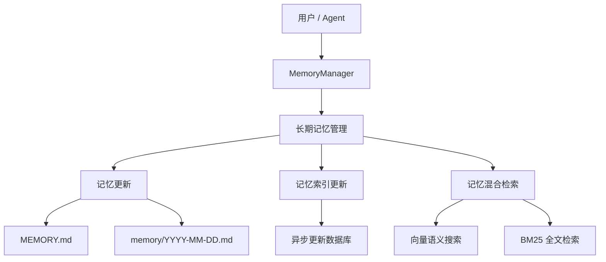
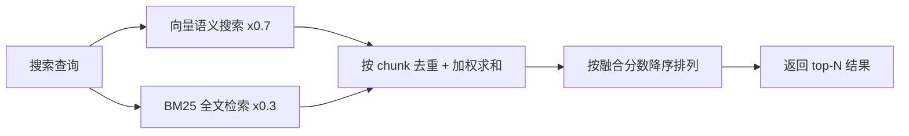

# 长期记忆

**长期记忆** 让 QwenPaw 拥有跨对话的持久记忆能力：通过文件工具将关键信息写入 Markdown 文件长期保存，并配合语义检索随时召回。

> 长期记忆机制设计受 [OpenClaw](https://github.com/openclaw/openclaw)
> 启发，由 [ReMe](https://github.com/agentscope-ai/ReMe) 的 **ReMeLight** 实现——以文件系统为存储后端，记忆即 Markdown
> 文件，可直接读取、编辑与迁移。

---

## 架构概览



长期记忆管理包含以下能力：

| 能力           | 说明                                                                                    |
| -------------- | --------------------------------------------------------------------------------------- |
| **记忆持久化** | 通过文件工具（`read` / `write` / `edit`）将关键信息写入 Markdown 文件，文件即真实数据源 |
| **文件监控**   | 通过 `watchfile` 监控文件改动，异步更新本地数据库（语义索引 & 向量索引）                |
| **语义搜索**   | 通过向量嵌入 + BM25 混合检索，按语义召回相关记忆                                        |
| **文件读取**   | 直接通过文件工具读取对应的 Memory Markdown 文件，按需加载保持上下文精简                 |
| **梦境优化**   | 定时自动整理和优化 MEMORY.md，去冗存精，保持记忆库的高质量                              |

---

## 记忆文件结构

记忆采用纯 Markdown 文件存储，Agent 通过文件工具直接操作。默认工作空间使用以下层次结构：

```
{工作区}/
├── MEMORY.md              ← Auto-Dream优化的长期记忆（结晶化）
│   包含：核心决策、用户偏好、可复用经验
│
├── memory/                ← Auto-Memory写入的每日记忆（原始记录）
│   ├── 2026-04-20.md
│   ├── 2026-04-21.md      ← Auto-Dream读取当日日志
│   └── ...
│
└── backup/                ← Auto-Dream创建的备份
    ├── memory_backup_20260421_230000.md
    └── ...                ← 可用于恢复历史版本
```

### MEMORY.md（长期记忆，可选）

存放长期有效、极少变动的关键信息。

- **位置**：`{working_dir}/MEMORY.md`
- **用途**：存储决策、偏好、持久性事实、经验教训
- **更新**：Agent 通过 `write` / `edit` 文件工具写入，或通过 **Auto-Dream** 自动优化

### memory/YYYY-MM-DD.md（每日日志）

每天一页，追加写入，记录当天的工作与交互。

- **位置**：`{working_dir}/memory/YYYY-MM-DD.md`
- **用途**：记录日常笔记和运行上下文
- **更新**：Agent 通过 `write` / `edit` 文件工具追加写入，对话过长需要进行总结时自动触发
- **角色**：作为 **Auto-Dream** 优化的输入源

### backup/（备份目录）

存储 Auto-Dream 优化前的 MEMORY.md 备份文件。

- **位置**：`{working_dir}/backup/`
- **用途**：每次 Auto-Dream 执行前自动创建备份，可用于恢复历史版本
- **命名格式**：`memory_backup_YYYYMMDD_HHMMSS.md`

> 关于 Auto-Memory、Auto-Dream、Auto-Memory-Search 和 Proactive
> 的完整工作流介绍，请参阅 [智能体记忆进化与主动交互](./memory-evolving-and-proactive.zh.md)。以下仅补充技术实现细节与配置说明。

---

## 搜索记忆

Agent 有两种方式找回过去的记忆：

| 方式     | 工具            | 适用场景                           | 示例                        |
| -------- | --------------- | ---------------------------------- | --------------------------- |
| 语义搜索 | `memory_search` | 不确定记在哪个文件，按意图模糊召回 | "之前关于部署流程的讨论"    |
| 直接读取 | `read_file`     | 已知具体日期或文件路径，精确查阅   | 读取 `memory/2025-02-13.md` |

### 混合检索原理

记忆搜索默认采用**向量 + BM25 混合检索**，两种检索方式各有所长，互为补充。

#### 向量语义搜索

将文本映射到高维向量空间，通过余弦相似度衡量语义距离，能捕捉意义相近但措辞不同的内容：

| 查询                   | 能召回的记忆                       | 为什么能命中                     |
| ---------------------- | ---------------------------------- | -------------------------------- |
| "项目的数据库选型"     | "最终决定用 PostgreSQL 替换 MySQL" | 语义相关：都在讨论数据库技术选择 |
| "怎么减少不必要的重建" | "配置了增量编译避免全量构建"       | 语义等价：减少重建 ≈ 增量编译    |
| "上次讨论的性能问题"   | "P99 延迟从 800ms 优化到 200ms"    | 语义关联：性能问题 ≈ 延迟优化    |

但向量搜索对**精确、高信号的 token** 表现较弱，因为嵌入模型倾向于捕捉整体语义而非单个 token 的精确匹配。

#### BM25 全文检索

基于词频统计进行子串匹配，对精确 token 命中效果极佳，但在语义理解（同义词、改写）方面较弱。

| 查询                       | BM25 能命中            | BM25 会漏掉                    |
| -------------------------- | ---------------------- | ------------------------------ |
| `handleWebSocketReconnect` | 包含该函数名的记忆片段 | "WebSocket 断线重连的处理逻辑" |
| `ECONNREFUSED`             | 包含该错误码的日志记录 | "数据库连接被拒绝"             |

**打分逻辑**：将查询拆分为词，统计每个词在目标文本中的命中比例，并为完整短语匹配提供加分：

```
base_score = 命中词数 / 查询总词数           # 范围 [0, 1]
phrase_bonus = 0.2（仅当多词查询且完整短语匹配时）
score = min(1.0, base_score + phrase_bonus)  # 上限 1.0
```

示例：查询 `"数据库 连接 超时"` 命中一段只包含 "数据库" 和 "超时" 的文本 → `base_score = 2/3 ≈ 0.67`，无完整短语匹配 →
`score = 0.67`

> 为了处理 ChromaDB `$contains` 的大小写敏感问题，检索时会自动生成每个词的多种大小写变体（原文、小写、首字母大写、全大写），提高召回率。

#### 混合检索融合

同时使用向量和 BM25 两路召回信号，对结果进行**加权融合**（默认向量权重 `0.7`，BM25 权重 `0.3`）：

1. **扩大候选池**：将最终需要的结果数乘以 `candidate_multiplier`（默认 3 倍，上限 200），两路分别检索更多候选
2. **独立打分**：向量和 BM25 各自返回带分数的结果列表
3. **加权合并**：按 chunk 的唯一标识（`path + start_line + end_line`）去重融合
   - 仅被向量召回 → `final_score = vector_score × 0.7`
   - 仅被 BM25 召回 → `final_score = bm25_score × 0.3`
   - **两路都召回** → `final_score = vector_score × 0.7 + bm25_score × 0.3`
4. **排序截断**：按 `final_score` 降序排列，返回 top-N 结果

**示例**：查询 `"handleWebSocketReconnect 断线重连"`

| 记忆片段                                               | 向量分数 | BM25 分数 | 融合分数                       | 排序 |
| ------------------------------------------------------ | -------- | --------- | ------------------------------ | ---- |
| "handleWebSocketReconnect 函数负责 WebSocket 断线重连" | 0.85     | 1.0       | 0.85×0.7 + 1.0×0.3 = **0.895** | 1    |
| "网络断开后自动重试连接的逻辑"                         | 0.78     | 0.0       | 0.78×0.7 = **0.546**           | 2    |
| "修复了 handleWebSocketReconnect 的空指针异常"         | 0.40     | 0.5       | 0.40×0.7 + 0.5×0.3 = **0.430** | 3    |



> **总结**：单独使用任何一种检索方式都存在盲区。混合检索让两种信号互补，无论是「自然语言提问」还是「精确查找」，都能获得可靠的召回结果。

---

## 记忆配置

### 配置结构

记忆配置位于 `agent.json` 的 `running.reme_light_memory_config` 中：

| 配置项                          | 说明                                                                        | 默认值         |
| ------------------------------- | --------------------------------------------------------------------------- | -------------- |
| `summarize_when_compact`        | 是否在上下文压缩时后台保存长期记忆（调用 `summary_memory` 写入文件）        | `true`         |
| `auto_memory_interval`          | 每隔 N 次用户查询触发自动记忆。`1` 表示每条用户消息后触发；null 表示禁用    | `1`            |
| `dream_cron`                    | 梦境记忆优化任务的 Cron 表达式（空字符串表示禁用）                          | `"0 23 * * *"` |
| `rebuild_memory_index_on_start` | 启动时是否清空并重建记忆搜索索引；设为 `false` 可跳过重建，仅监控新文件变更 | `false`        |
| `recursive_file_watcher`        | 是否递归监控记忆目录（包含子目录如 `memory/subdirectory/*`）                | `false`        |

### 自动记忆搜索配置

在 `running.reme_light_memory_config.auto_memory_search_config` 中配置：

| 配置项        | 说明                                        | 默认值  |
| ------------- | ------------------------------------------- | ------- |
| `enabled`     | 是否在每次对话时自动执行记忆搜索            | `false` |
| `max_results` | 自动搜索时最多返回的结果数                  | `1`     |
| `min_score`   | 自动搜索时的最低相关性分数阈值（0.0 ~ 1.0） | `0.1`   |
| `timeout`     | 自动搜索超时时间（秒）                      | `10.0`  |

### Embedding 配置（可选）

Embedding 配置用于向量语义搜索，位于 `running.reme_light_memory_config.embedding_model_config`：

| 配置项             | 说明                                  | 默认值   |
| ------------------ | ------------------------------------- | -------- |
| `backend`          | Embedding 后端类型                    | `openai` |
| `api_key`          | Embedding 服务的 API Key              | ``       |
| `base_url`         | Embedding 服务的 URL                  | ``       |
| `model_name`       | Embedding 模型名称                    | ``       |
| `dimensions`       | 向量维度，用于初始化向量数据库        | `1024`   |
| `enable_cache`     | 是否启用 Embedding 缓存               | `true`   |
| `use_dimensions`   | 是否在 API 请求中传递 dimensions 参数 | `false`  |
| `max_cache_size`   | Embedding 缓存最大条目数              | `3000`   |
| `max_input_length` | 单次 Embedding 最大输入长度           | `8192`   |
| `max_batch_size`   | Embedding 批处理最大数量              | `10`     |

> `use_dimensions` 用于某些 vLLM 模型不支持 dimensions 参数的情况，设为 `false` 可跳过该参数。

#### 通过环境变量配置（Fallback）

当配置文件中未设置时，以下环境变量作为 fallback：

| 环境变量               | 说明                     | 默认值 |
| ---------------------- | ------------------------ | ------ |
| `EMBEDDING_API_KEY`    | Embedding 服务的 API Key | ``     |
| `EMBEDDING_BASE_URL`   | Embedding 服务的 URL     | ``     |
| `EMBEDDING_MODEL_NAME` | Embedding 模型名称       | ``     |

> `base_url` 和 `model_name` 都非空才能开启混合检索中的向量检索（`api_key` 不参与判断）。

### 全文检索配置

通过环境变量 `FTS_ENABLED` 控制是否启用 BM25 全文检索：

| 环境变量      | 说明             | 默认值 |
| ------------- | ---------------- | ------ |
| `FTS_ENABLED` | 是否启用全文检索 | `true` |

> 即使不配置 Embedding，启用全文检索仍可通过 BM25 进行关键词搜索。

### 底层数据库

通过 `MEMORY_STORE_BACKEND` 环境变量配置记忆存储后端：

| 环境变量               | 说明                                                   | 默认值 |
| ---------------------- | ------------------------------------------------------ | ------ |
| `MEMORY_STORE_BACKEND` | 记忆存储后端，可选 `auto`、`local`、`chroma`、`sqlite` | `auto` |

**存储后端说明：**

| 后端     | 说明                                                                         |
| -------- | ---------------------------------------------------------------------------- |
| `auto`   | 自动选择：Windows 使用 `local`，其他系统使用 `chroma`                        |
| `local`  | 本地文件存储，无需额外依赖，兼容性最好                                       |
| `chroma` | Chroma 向量数据库，支持高效向量检索；在某些 Windows 环境下可能出现 core dump |
| `sqlite` | SQLite 数据库 + 向量扩展；在 macOS 14 及更低版本上存在卡死和闪退问题         |

> **推荐**：使用默认的 `auto` 模式，系统会根据平台自动选择最稳定的后端。

---

## 其他 Memory Backend

QwenPaw 的记忆系统采用可插拔的 Backend 架构。除了默认的 ReMeLight（本地文件存储）外，还支持通过 `memory_manager_backend` 切换到其他后端。

### ADBPG（AnalyticDB for PostgreSQL）

基于云端向量数据库的长期记忆后端，适合需要跨设备共享、大规模语义检索的场景。

**核心特点：**

- **跨会话持久化** — 记忆存储在云端数据库，重启后不丢失，支持多设备共享
- **服务端事实抽取** — 由 ADBPG 内置 LLM 完成事实提取，客户端无额外开销
- **双 API 模式** — 支持 SQL 直连和 REST API 两种接入方式
- **优雅降级** — ADBPG 不可达时 Agent 正常运行，仅长期记忆功能暂时禁用

**配置方式：**

进入 Agent 配置页面的「运行配置」标签，找到「记忆管理后端」下拉框，选择 `adbpg`，并在下方的 `adbpg_memory_config` 中根据所选 API 模式填写对应参数。


> ⚠️ 切换后端不支持热更新，保存后需要重启 QwenPaw 才能生效（页面也会以黄色横幅提醒）。

#### REST 模式（推荐）

通过 HTTP API 接入 ADBPG 记忆服务，无需额外 Python 依赖。

切换到「ADBPG 长期记忆」Tab，将「API 模式」设为 `REST API`，并填写 `REST Base URL` 与 `REST API Key`：


| 配置项             | 说明                                                   | 默认值   |
| ------------------ | ------------------------------------------------------ | -------- |
| `api_mode`         | API 模式，设为 `"rest"`                                | `"rest"` |
| `rest_base_url`    | ADBPG 记忆服务的 REST API 地址                         | `""`     |
| `rest_api_key`     | REST API 的访问密钥                                    | `""`     |
| `memory_isolation` | 记忆隔离模式，`true` 为每个 Agent 独立，`false` 为共享 | `true`   |
| `search_timeout`   | 记忆搜索超时时间（秒）                                 | `10.0`   |

#### SQL 模式

通过 psycopg2 直连 ADBPG 数据库，需额外安装依赖：`pip install qwenpaw[adbpg]`。

切换到「ADBPG 长期记忆」Tab，将「API 模式」设为 `SQL (Direct)`，并填写数据库连接信息（主机地址 / 端口 / 用户名 / 密码 / 数据库名）以及 LLM、Embedding 相关参数：


| 配置项               | 说明                            | 默认值  |
| -------------------- | ------------------------------- | ------- |
| `api_mode`           | API 模式，设为 `"sql"`          | `"sql"` |
| `host`               | ADBPG 数据库地址                | `""`    |
| `port`               | 数据库端口                      | `5432`  |
| `user`               | 数据库用户名                    | `""`    |
| `password`           | 数据库密码                      | `""`    |
| `dbname`             | 数据库名称                      | `""`    |
| `llm_model`          | 服务端事实抽取使用的 LLM 模型名 | `""`    |
| `llm_api_key`        | LLM 服务的 API Key              | `""`    |
| `llm_base_url`       | LLM 服务的 Base URL             | `""`    |
| `embedding_model`    | Embedding 模型名称              | `""`    |
| `embedding_api_key`  | Embedding 服务的 API Key        | `""`    |
| `embedding_base_url` | Embedding 服务的 Base URL       | `""`    |
| `embedding_dims`     | 向量维度                        | `1024`  |
| `memory_isolation`   | 记忆隔离模式                    | `true`  |
| `search_timeout`     | 记忆搜索超时时间（秒）          | `10.0`  |
| `pool_minconn`       | 连接池最小连接数                | `1`     |
| `pool_maxconn`       | 连接池最大连接数                | `5`     |

**配置示例：**

完整配置可写入 `agent.json` 的 `running.adbpg_memory_config` 字段：

```json
{
  "running": {
    "memory_manager_backend": "adbpg",
    "adbpg_memory_config": {
      "host": "gp-xxxxxxxxx-master.gpdb.rds.aliyuncs.com",
      "port": 5432,
      "user": "your_db_user",
      "password": "your_db_password",
      "dbname": "your_db_name",
      "llm_model": "qwen-plus",
      "llm_api_key": "sk-xxxxxxxx",
      "llm_base_url": "https://dashscope.aliyuncs.com/compatible-mode/v1",
      "embedding_model": "text-embedding-v3",
      "embedding_api_key": "sk-xxxxxxxx",
      "embedding_base_url": "https://dashscope.aliyuncs.com/compatible-mode/v1",
      "embedding_dims": 1024,
      "api_mode": "sql",
      "rest_api_key": "",
      "rest_base_url": "",
      "memory_isolation": true,
      "search_timeout": 10.0,
      "pool_minconn": 1,
      "pool_maxconn": 5
    }
  }
}
```

> 💡 通过 Console 「运行配置」页面填写时，框架会自动将这些字段写入 `agent.json`，无需手动编辑文件。

---

## 相关页面

- [智能体记忆进化](./memory-evolving-and-proactive.zh.md) — Auto-Memory、Auto-Dream、Auto-Memory-Search、Proactive 完整工作流
- [项目介绍](./intro.zh.md) — 这个项目可以做什么
- [控制台](./console.zh.md) — 在控制台管理记忆与配置
- [Skills](./skills.zh.md) — 内置与自定义能力
- [配置与工作目录](./config.zh.md) — 工作目录与 config
